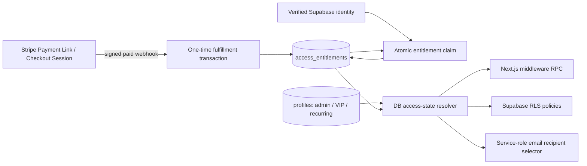

# Architecture Decision Document

_This document builds collaboratively through step-by-step discovery. Sections are appended as we work through each architectural decision together._

## Project Context Analysis

### Requirements Overview

**Functional Requirements:**

- **Контент и Лента:** Клиентский SPA для ленты, поиска, категоризации, отображения мультимедиа (фото/видео) и галерей (до 10 элементов).
- **Монетизация и Доступ:** Автоматизированное управление recurring subscriptions через Stripe Webhooks и отдельный entitlement lifecycle для временного one-time доступа. Строгая матрица доступов (RBAC) между Гостем, Участницей и Автором.
- **Сообщество:** Одноуровневые комментарии, email-уведомления.
- **Администрирование:** Публикация контента, управление пользователями, выбор превью для лендинга.
- **Миграция:** Разовый импорт архива из Telegram (интеллектуальная группировка медиа без потерь, поддержка стейт-переходов и Exponential Backoff при Rate Limit ошибках).

**Non-Functional Requirements:**

- **Производительность:** Mobile-first фокус (iOS Safari, Android Chrome). Гарантия 95th percentile response time ≤ 500ms (с учетом нормализованных медиа-запросов). Одновременно активно воспроизводится только одно видео.
- **Архитектурные ограничения:** v1 — это чисто клиентский SPA (SSR перенесен в v1.1), стандартные HTTP-запросы для комментариев (WebSockets перенесены в v1.1).
- **UI/UX Архитектура:** Строгое разделение UI (dumb components) и бизнес-логики, компонент `GalleryGrid` со сложной логикой сетки/карусели, поддержка Open Graph (`og:image`).

**Scale & Complexity:**

- **Primary domain:** Web / Full-stack (платформа сообщества на базе эксперта)
- **Complexity level:** Low-Medium
- **Estimated architectural components:** Умеренное количество (Модуль Auth/Stripe, Модуль Контента/Ленты, Модуль Комментариев, Админ-панель).

### Technical Constraints & Dependencies

- **Ресурсы:** Один full-stack разработчик (требует простого, стандартного стека технологий и чистой документации).
- **Интеграции:** Stripe API (раздельные lifecycle recurring subscriptions и one-time payment fulfillment через webhooks).
- **Инфраструктура:** CDN / Провайдер медиа-хранилища для надежного воспроизведения мобильного видео.

### Cross-Cutting Concerns Identified

- **Authentication & Authorization:** JWT + проверка статуса Stripe для защиты маршрутов и контента.
- **Media Management:** Загрузка, обработка и эффективная отдача изображений/видео.
- **State Management:** Кэширование ленты, управление состоянием UI (MobileNav, Bottom Sheets) и изолированное состояние дерева комментариев.

## Starter Template Evaluation

### Primary Technology Domain

Web / Full-stack Application based on project requirements analysis (SPA для MVP, SSR/SSG для Phase 1.1).

### Starter Options Considered

- **Vite + React + TypeScript:** Идеально подходит для чистого SPA (как требуется в v1), быстрая сборка, минимальный overhead. Однако внедрение SSR/SSG в v1.1 потребует значительных усилий или миграции.
- **Next.js (App Router) + TypeScript:** Идеально покрывает как v1 (клиентские компоненты для SPA-зоны), так и v1.1 (SSR/SSG для публичных страниц). Упростит реализацию гибридной стратегии рендеринга из PRD без необходимости переписывать архитектуру.

### Selected Starter: Next.js

**Rationale for Selection (Architecture Decision Record):**
Ограничение в "одного разработчика" делает архитектурные миграции крайне рискованными. Переход с Vite (чистый SPA) на Next.js (SSR) в Фазе 1.1, как указано в PRD для целей SEO, может остановить развитие продукта или потребовать создания второго независимого приложения для лендинга.

Использование Next.js изначально, с осознанным применением клиентских компонентов (`use client`) для зоны авторизованных пользователей, удовлетворяет требованиям SPA MVP. Это также решает UX-требования "mobile-first" и медиа-контента благодаря встроенной автоматической оптимизации изображений (Next/Image), что критически важно для производительности на мобильном интернете без сложной ручной настройки CDN.

**Ключевые паттерны реализации для снятия рисков:**

1. **SPA Навигация:** Обязательное использование вложенных `Layouts` в App Router для Bottom Navigation, чтобы обеспечить мгновенный отклик без перерендера общих элементов UI (сохранение состояния).
2. **Медиа-оптимизация:** Обязательное использование встроенных инструментов (`next/image`) для автоматической оптимизации тяжелого контента.

**Initialization Command:**

```bash
npx create-next-app@latest . --typescript --tailwind --eslint --app --src-dir --import-alias "@/*"
```

**Architectural Decisions Provided by Starter:**

**Language & Runtime:**
TypeScript для строгой типизации поверх Node.js/React.

**Styling Solution:**
Tailwind CSS сконфигурирован по умолчанию (идеально для реализации mobile-first UI и изолированных компонентов).

**Build Tooling:**
Next.js встроенный сборщик (Turbopack/Webpack) с автоматической оптимизацией медиа-ресурсов (важно для видео и фото контента платформы).

**Testing Framework:**
Не включен по умолчанию (потребует настройки Vitest/Jest отдельно, если необходимо).

**Code Organization:**
App Router в директории `src/app`, file-system based routing с поддержкой вложенных layout-ов, что хорошо подходит для разделения публичной (marketing) и приватной (app) зон.

**Development Experience:**
React Fast Refresh, настроенный ESLint, удобная работа с переменными окружения (.env).

**Note:** Project initialization using this command should be the first implementation story.

## Core Architectural Decisions

### Decision Priority Analysis

**Critical Decisions (Block Implementation):**

- Data Architecture & Auth (Supabase)
- Temporary One-Time Access (entitlement ledger + canonical access-state resolver)
- Frontend State Management (Zustand)
- Infrastructure & Hosting (Vercel)
- Content Editor System (Tiptap + sanitized HTML rendering)
- Scheduled Publishing (pg_cron + статусная модель)

**Important Decisions (Shape Architecture):**

- Stripe Integration Pattern (Webhooks)
- Media Storage Pattern (Supabase Storage + Next/Image)
- Storage Bucket Architecture (inline vs gallery images)

**Deferred Decisions (Post-MVP):**

- WebSockets/Real-time комментарии (отложено до v1.1)
- SSR для публичных страниц (SEO отложено до v1.1, MVP использует клиентские компоненты)

### Data Architecture, Authentication & Security

- **Decision:** PostgreSQL + Supabase Auth
- **Version:** Supabase (Latest 2.x)
- **Rationale:** В условиях "одного разработчика" требуется надежное Backend-as-a-Service (BaaS) решение. Supabase закрывает Аутентификацию, Реляционную Базу Данных (нормализация данных - `post_media` связанная с `posts`) и Хранилище (Storage) для видео/фото. Row Level Security обеспечит надежное соблюдение спецификаций RBAC. Интегрируется со Stripe через Webhooks.
- **Affects:** Auth Module, User Profiles, Content Feed (Gallery Data)

### Temporary One-Time Access Architecture (01.09–01.12.2026)

#### Design paradigm: Policy Decision Point / Policy Enforcement Points

`access_entitlements` является отдельным ledger прав доступа, Stripe webhook — единственным источником подтверждённого payment fact, а DB access-state resolver — единственным Policy Decision Point (PDP). Middleware, RLS и email recipient selection являются Policy Enforcement Points (PEP) и не воспроизводят правила доступа собственными условиями.



#### AD-TA1 — Recurring и one-time являются независимыми lifecycle

- **Binds:** Stripe checkout, webhook, auth, profiles, RLS, email notifications.
- **Prevents:** использование `subscription_status='active'` как суррогата временного доступа и повреждение действующих subscriptions.
- **Rule:** one-time flow записывает только `access_entitlements` и собственный audit context. Он не создаёт, не обновляет и не отменяет Stripe Subscription и не пишет в `stripe_subscription_id`, `subscription_status`, `current_period_end`, price, billing interval или `cancel_at_period_end`. Existing subscription handlers продолжают принимать только subscription events/resources.

#### AD-TA2 — Entitlement создаётся только из валидного paid webhook

- **Binds:** `checkout.session.completed`, `checkout.session.async_payment_succeeded`, fulfillment transaction.
- **Prevents:** выдачу доступа по success redirect, client clock, произвольной one-time оплате или повторной доставке.
- **Rule:** fulfillment начинается только после проверки Stripe signature на raw body и затем проверяет `mode='payment'`, paid status, exact `payment_link_id`, exact `price_id`, `offer_code`, `offer_version`, amount, currency и quantity по server-only allowlist. `checkout.session.completed` исполняется только при `payment_status='paid'`; delayed methods входят через тот же handler после `checkout.session.async_payment_succeeded`. Уникальный `stripe_checkout_session_id` делает retry и параллельную доставку no-op и никогда не продлевает существующий grant.
- **Rule:** после signature verification handler повторно получает Checkout Session server-side с expanded `line_items` и использует retrieved values для Price/quantity/amount/currency/payment status checks; webhook snapshot и metadata сами по себе не являются достаточной product allowlist validation.
- **Rule:** `paid_at` — Stripe-origin `event.created` единственного qualifying paid-event для Session: `checkout.session.completed` при `payment_status='paid'` для immediate payment либо `checkout.session.async_payment_succeeded` для delayed payment, чей completed-event не был paid. Retry сохраняет тот же `event.id/event.created`; receipt order не выбирает timestamp и повторное событие не меняет `paid_at`.

#### AD-TA3 — Grant ledger отделён от append-only payment attempts

- **Binds:** schema, claim, support audit, expiry.
- **Prevents:** смешивание billing state с authorization state и потерю доказательства происхождения права.
- **Rule:** `payment_fulfillment_attempts` — append-only audit всех qualifying/exception Sessions с unique `stripe_checkout_session_id`, nullable unique `stripe_payment_intent_id`, `stripe_event_id`, Link/Price/metadata, canonical purchaser email, amount/currency, `paid_at`, immutable disposition и safe error context. Он никогда не участвует в access predicate и не хранит mutable refund status.
- **Rule:** `access_entitlements` хранит только единственный grant: `id`, nullable `user_id -> auth.users(id)`, `source='stripe_one_time'`, `status`, `offer_code/version`, unique `fulfillment_attempt_id`, `purchaser_email_normalized`, `paid_at`, `access_starts_at`, `access_ends_at`, nullable `claimed_at`, nullable `revoked_at`, `created_at`.
- **Rule:** `payment_refund_cases` отдельно владеет mutable refund lifecycle для non-granting attempt: unique `fulfillment_attempt_id`, `status`, nullable `stripe_refund_id`, `last_error_code`, `created_at`, `updated_at`. Изменение refund case никогда не изменяет attempt или entitlement.
- **Rule:** lifecycle grant — `unclaimed -> claimed`; expiry является вычисляемым состоянием и не записывается cron-задачей. `unclaimed` — только webhook-verified payment candidate, не выданное право. Active entitlement существует только после verified-email claim при `status='claimed'`, non-null `user_id/claimed_at`, `revoked_at IS NULL` и `access_starts_at <= evaluated_at AND evaluated_at < access_ends_at`.
- **Rule:** DB unique constraint на `(offer_code, purchaser_email_normalized)` является обязательной частью schema, не Deferred. В atomic transaction fulfillment сначала фиксирует attempt, затем `INSERT ... ON CONFLICT DO NOTHING` пытается занять grant key; первая transaction, успешно вставившая unique key, является authoritative winner. Проигравшие distinct Sessions получают disposition `duplicate_review` и не могут заменить/продлить winner.
- **Rule:** authoritative purchaser identity берётся только из retrieved `Checkout Session.customer_details.email`; значение обязано присутствовать и нормализуется один раз как `lower(btrim(email))`. Metadata, redirect query и PaymentIntent email не подменяют этот источник; отсутствие email создаёт non-granting exception.

#### AD-TA4 — Три календарных месяца считаются в явной timezone

- **Binds:** `paid_at`, `access_starts_at`, `access_ends_at`, tests around DST and month ends.
- **Prevents:** подмену трёх календарных месяцев 90 днями и зависимость результата от session `TimeZone` PostgreSQL.
- **Rule:** `access_starts_at = paid_at`; `access_ends_at` вычисляется один раз в той же DB transaction с calendar arithmetic `+ interval '3 months'` в `Europe/Ljubljana`, затем сохраняется как `timestamptz`. Эквивалентная явная форма: `((paid_at AT TIME ZONE 'Europe/Ljubljana') + interval '3 months') AT TIME ZONE 'Europe/Ljubljana'`. Правая граница exclusive: при `evaluated_at = access_ends_at` доступа нет.

#### AD-TA5 — Claim наследует verified identity binding

- **Binds:** `/auth/confirm`, authenticated post-payment/login return, entitlement claim RPC.
- **Prevents:** account takeover через введённый в Stripe чужой email или украденный `session_id`.
- **Rule:** webhook сначала создаёт `unclaimed` entitlement. После Supabase email verification server-side claim атомарно связывает только webhook-issued `unclaimed` record с `(select auth.uid())`, когда `lower(btrim(auth.users.email)) = purchaser_email_normalized`. Provider-specific aliasing (`+tag`, Gmail dots) не применяется. Один entitlement нельзя присоединить к двум users.
- **Rule:** success redirect и `{CHECKOUT_SESSION_ID}` являются UX hint. Они не создают, не подтверждают и не продлевают право; claim не выполняет fallback, который строит entitlement непосредственно из Stripe API response.
- **Rule:** Payment Link возвращает новую покупательницу в существующий register/verification entry point, а существующую verified покупательницу — в login/authenticated return. Оба пути после получения authenticated identity вызывают один atomic claim contract; если webhook ещё не доставлен, UI показывает pending state и безопасно повторяет claim без создания права из Stripe redirect.

#### AD-TA6 — Один access-state resolver управляет всеми gates

- **Binds:** middleware, posts/post_media/post_comments RLS, email recipient selection, access cache.
- **Prevents:** ситуацию, когда middleware пропускает, RLS возвращает пустые данные, email включает истёкших users или cache переживает deadline.
- **Rule:** private DB resolver принимает `user_id` и `evaluated_at` и возвращает `has_access`, полный уникальный `sources[]`, `valid_until` и `evaluated_at`. Wire identifiers фиксированы как `admin`, `vip`, `recurring`, `temporary_one_time` и возвращаются в этом canonical order без duplicates. Если `has_access=false`, `valid_until=evaluated_at`; если существует admin/VIP/recurring source без локального entitlement deadline, `valid_until=NULL`; если доступ дают только time-limited grants, `valid_until=max(active access_ends_at)`. PEPs не назначают собственный source priority.
- **Rule:** RLS вызывает authenticated-only no-argument `public.has_current_content_access()`, который под `SECURITY DEFINER` передаёт `(select auth.uid())` и DB time private core resolver. Middleware вызывает no-argument authenticated RPC `public.get_my_content_access_state()`, возвращающий ровно одну row shape: `has_access boolean NOT NULL`, `sources text[] NOT NULL`, `valid_until timestamptz NULL`, `evaluated_at timestamptz NOT NULL`. Email pipeline вызывает service-role-only recipient RPC, основанный на том же private resolver, и поверх доступа применяет `email_notifications_enabled=true` и существующую audience policy, расширенную источником `temporary_one_time`; admin/VIP не добавляются в рассылку только из-за этого change.
- **Rule:** resolver и claim helpers размещаются в non-exposed schema, используют schema-qualified names и `search_path=''`. Public RPC wrappers не принимают произвольный `user_id`; `EXECUTE` отозван у `PUBLIC`/`anon` и выдан только необходимой роли. `access_entitlements` имеет RLS и не доступен для client-side mutations.
- **Rule:** полный PEP inventory охватывает protected `posts`, `post_media`, `post_comments`, `post_likes`, likes/comments mutation policies, `toggle_like` и другие content RPC, `storage.objects` для `gallery-media`/`inline-images`, views и все public `SECURITY DEFINER` functions. Embedded `subscription_status`, `is_vip` и legacy `is_active_subscriber()` checks заменяются canonical wrapper/resolver; function/view grants и `security_invoker` semantics аудитятся до rollout.
- **Rule:** отдельные anonymous policies допустимы только для явно публичного preview/avatar/site-assets contract и не могут раскрывать protected body/media/comments/engagement data. Profile exposure аудитится отдельно и не раскрывает authorization/payment fields; protected media нельзя делать public bucket/object ради обхода RLS.

#### AD-TA7 — Middleware cache не является источником доступа

- **Binds:** `__sub_status` successor, exact expiry, NFR7.
- **Prevents:** доступ после `access_ends_at` и подмену cache token.
- **Rule:** signed HttpOnly cache token привязан к `user_id`, содержит effective access и entitlement `valid_until`. Его lifetime равен `min(configured_ttl, valid_until - now)`; token с достигнутым deadline считается invalid независимо от cookie expiry. Для admin/VIP/recurring сохраняется короткий действующий TTL, чтобы существующая revocation latency не ухудшалась.
- **Rule:** wire token хранит `sources` в canonical identifiers и `valid_until_epoch: integer|null`, где integer — Unix time в целых UTC seconds. `NULL` означает только отсутствие entitlement-bound deadline, не бесконечный cache: cookie всё равно истекает по configured short TTL и затем повторно вызывает PDP.

#### AD-TA8 — Offer window и purchase eligibility вычисляются server-side

- **Binds:** pricing UI, CTA redirect gate, temporary Payment Link, recurring checkout rollback.
- **Prevents:** продажу по stale UI/client time и удаление baseline recurring path.
- **Rule:** один server-only `TemporaryOfferConfig` является владельцем start/end/timezone, offer code/version, exact Link/Price IDs, amount/currency/quantity и metadata. Он загружает ровно один explicit environment (`test` или `live`) и fail-closed валидирует согласованность Stripe key/ID/link namespace; mixed/missing config отключает temporary UI/redirect и не допускает fulfillment. UI mode, redirect gate, webhook allowlist и rollback evidence читают этот contract; дублирование constants/env parsing запрещено.
- **Rule:** canonical window — `[2026-09-01T00:00:00+02:00, 2026-12-01T00:00:00+01:00)` (`Europe/Ljubljana`). UI получает только server-derived offer mode. Temporary Link URL выдаётся только через server redirect gate внутри окна.
- **Rule:** authenticated `active`/`trialing` users и purchaser с уже существующим grant для `offer_code` не получают Link; бывшая подписчица с неактивным recurring status допускается. Это app-level eligibility: сохранённый/переданный direct Payment Link технически остаётся внешним обходом. Paid direct Sessions для ineligible/duplicate users не получают grant и переходят в approved refund/support flow.
- **Rule:** original `/api/checkout` contract `monthly|quarterly`, recurring Price IDs и UI baseline сохраняются пригодными для rollback и не переиспользуются one-time flow.
- **Rule:** temporary pricing contract рендерит одну карточку и не содержит recurring plan selector, monthly/per-month math, cancellation/autorenewal copy или обещание частоты новых материалов. Server-derived mode является единственным переключателем между temporary и сохранённым recurring baseline.

#### AD-TA9 — Rollback прекращает продажу, но не entitlement lifecycle

- **Binds:** 2026-12-01 cutoff, UI/config, Payment Link operation, late/retried webhooks.
- **Prevents:** отзыв уже оплаченного доступа и потерю fulfillment из-за webhook retry после окончания offer.
- **Rule:** с `2026-12-01T00:00:00+01:00` server-derived mode возвращает recurring UI и checkout, redirect gate не выдаёт temporary Link, а Owner деактивирует allowlisted Payment Link. Existing recurring objects и subscriptions не мутируются.
- **Rule:** fulfillment handler остаётся доступным для retries. Eligibility определяется immutable `paid_at`, а не receipt time: webhook, доставленный после cutoff, может завершить grant только когда qualifying event `event.created` находится внутри окна. Новый `checkout.session.async_payment_succeeded` с `event.created` после cutoff является out-of-window payment, grant не создаёт и входит в refund path. Все ранее выданные entitlements продолжают действовать до собственного `access_ends_at`.

**Executable rollback contract:**

1. Accountable — Owner; Responsible — заранее назначенный Operations operator; DEV является technical escalation. До cutoff operator фиксирует baseline recurring UI/config и подтверждает готовность rollback artifact.
2. В cutoff server-time mode автоматически прекращает Link redirects и возвращает recurring UI/checkout независимо от Stripe operation.
3. Назначенный operator деактивирует exact allowlisted Payment Link, сохраняет Link ID, timestamp и Stripe evidence; при ошибке немедленно сохраняется fail-closed app gate и запускается escalation/fallback из утверждённого runbook.
4. Smoke verification подтверждает recurring checkout, неизменность sample subscriptions, недоступность Link и сохранение ранее claimed entitlements до individual deadline.

#### AD-TA10 — Failure и exception paths остаются наблюдаемыми

- **Binds:** webhook NFR18/NFR19, duplicate/ineligible/late payments, support reconciliation.
- **Prevents:** silent loss valid payments и выдачу доступа при частичной обработке.
- **Rule:** invalid signature/shape завершается fail-closed; transient DB/processing failure возвращает retryable response и логирует safe `event.id/session.id`; accepted payment с business exception сохраняет `duplicate_review` или `ineligible_review` без grant. Для каждого exception доступен service-role/admin reconciliation path, но никакой manual action не меняет recurring fields.
- **Rule:** refundable business exception создаёт отдельный `payment_refund_cases` и проходит `refund_pending -> refunded | refund_failed_manual`; entitlement access всегда false, а append-only attempt не мутируется. Stripe refund mutation использует idempotency key, производный от Checkout Session ID. Production enablement запрещено, пока Owner/PM не утвердил automatic-vs-manual refund executor, SLA и customer communication.
- **Rule:** launch go/no-go требует valid single-environment config, controlled payment -> attempt -> claim -> middleware/RLS/email smoke, unchanged recurring fixtures и rollback rehearsal. Любой fulfillment 5xx для controlled event, resolver/RLS mismatch или production `refund_pending/refund_failed_manual` автоматически закрывает app redirect gate и создаёт alert; recurring access и уже claimed entitlements при этом не отключаются.

#### AD-TA11 — Authorization inputs не доступны для self-service mutation

- **Binds:** profiles RLS/column grants, recurring reconciliation, resolver integrity.
- **Prevents:** самостоятельную установку `role='admin'`, `is_vip=true` или `subscription_status='active'` через Data API.
- **Rule:** authenticated users получают UPDATE только на явно перечисленные self-service profile columns; `role`, `is_vip`, `subscription_status`, `stripe_customer_id`, `stripe_subscription_id`, `current_period_end` и entitlement/audit fields изменяются только trusted server/service-role paths. Existing middleware/auth reconciliation, которое пишет recurring fields пользовательским Supabase client, переносится за trusted server boundary до включения нового resolver.
- **Rule:** entitlement, fulfillment-attempt и refund-case tables имеют RLS enabled, `REVOKE ALL` от `anon/authenticated`, DML только у `service_role`, DELETE отсутствует в runtime grant. Private core resolver не исполняется `PUBLIC/anon/authenticated`; `public.has_current_content_access()` и `public.get_my_content_access_state()` исполняются только `authenticated`; recipient/exception RPC — только `service_role`. Для новых функций default `EXECUTE` у `PUBLIC` отозван.

#### Approval gate для реализации и операций

Архитектура не авторизует изменения кода, Stripe, Supabase или tracker. До реализации нужны отдельные решения:

1. **Owner/PM + Architect:** утвердить весь Major-change architecture package до изменения documentation downstream, code, Stripe, Supabase или tracker.
2. **Owner/PM + Architect:** утвердить exact test/live `payment_link_id`, `price_id`, `offer_code/version`, amount/currency/quantity, allowed payment methods и server-only config ownership.
3. **Architect:** утвердить migration-level schema, partial uniqueness для одного grant, private resolver/RPC privileges, полный RLS policy inventory/GRANT matrix и отсутствие Data API mutation surface.
4. **Owner/PM:** утвердить refund/support policy для direct ineligible purchase, duplicate distinct Session и delayed payment с `paid_at` после cutoff; без неё такие платежи не готовы к production launch.
5. **Owner/PM + Architect:** подтвердить mapping qualifying Stripe paid-event timestamp -> `paid_at` и календарную DST semantics `Europe/Ljubljana` для дат 29/30/31 числа.
6. **Owner/PM:** определить eligibility VIP/admin; до approval temporary CTA для уже имеющих доступ VIP/admin должна быть fail-closed.
7. **Owner/PM:** утвердить словенский pricing/post-payment/inactive copy. Включение temporary users в email audience уже принято данным change и не является открытым решением.
8. **Owner/Operations:** назначить ответственного и способ точной деактивации Payment Link на cutoff (scheduled operation либо midnight runbook), а также evidence и fallback при ошибке.
9. **Owner/Legal/Data:** утвердить retention/redaction для `purchaser_email_normalized`, unclaimed entitlements и exception audit с учётом payment records и GDPR.
10. **Owner/DEV/Security:** до implementation/launch обновить `next` с уязвимого project seed `16.1.6` минимум до актуального patched Active LTS (`16.3.3` на 2026-09-01) и повторно проверить official advisories; architecture не авторизует dependency change.

Технические основания сверены с актуальными официальными контрактами: [Stripe Checkout fulfillment](https://docs.stripe.com/checkout/fulfillment), [Stripe Payment Links API](https://docs.stripe.com/api/payment-link), [Stripe webhook signature verification](https://docs.stripe.com/webhooks/signature), [Supabase Row Level Security](https://supabase.com/docs/guides/database/postgres/row-level-security) и [Supabase Database Functions](https://supabase.com/docs/guides/database/functions).

### Frontend Architecture (State Management)

- **Decision:** Zustand
- **Version:** Zustand v5.x
- **Rationale:** В UX-спецификации описана сложная система изолированных UI-компонентов (MobileNav, Bottom Sheets, вложенные комментарии). Zustand обеспечивает легкое (minimal bundle size), атомарное управление глобальным состоянием UI без boilerplate-кода Redux и без проблем с перерендерами, свойственных React Context.
- **Affects:** UI State (MobileNav, Modals, Sheets), Caching Strategy

### Infrastructure & Deployment

- **Decision:** Vercel
- **Version:** N/A (Cloud Platform)
- **Rationale:** Нулевая конфигурация для Next.js. Автоматический CI/CD pipeline из GitHub. "Из коробки" поддерживает оптимизацию изображений (Next/Image), что критично для мобильного медиа-контента платформы. Полностью снимает DevOps-нагрузку с разработчика.
- **Affects:** Deployment Pipeline, Environment Configuration, Image Optimization

### Decision Impact Analysis

**Implementation Sequence:**

1. Next.js Repository Initialization
2. Supabase Project Setup & Schema Definition (включая статусы постов и Storage buckets)
3. Vercel Project Link & CI/CD Setup
4. Auth Integration (Supabase Auth)
5. Stripe Webhooks Integration
6. Temporary one-time entitlement ledger + access-state resolver (isolated change)
7. Global State (Zustand) + UI Shell (MobileNav)
8. Content Editor (Tiptap) + Media Upload
9. Scheduled Publishing (pg_cron + UI)

**Cross-Component Dependencies:**

- **Auth → Access PDP:** recurring status и claimed entitlements остаются в PostgreSQL; middleware, RLS и recipient selection получают effective access через один access-state resolver, а не через user-editable metadata или независимые проверки.
- **Stripe → Access Ledger:** subscription handlers обновляют только recurring fields; валидный payment-mode webhook создаёт только `access_entitlements`.
- **Supabase Storage → Next.js:** Медиафайлы из Supabase должны обслуживаться через пайплайн оптимизации Vercel (Next/Image) для соблюдения требований производительности.
- **Content Editor → Storage:** Инлайн-изображения загружаются в отдельный bucket `inline-images` при редактировании поста, а `posts.content` сохраняет HTML output из Tiptap как source of truth для article body.
- **pg_cron → Email Service:** Автоматическая публикация запланированных постов триггерит email-рассылку (NFR20, NFR25).
- **Post Status → Feed:** Лента фильтрует только `published` посты; `scheduled` и `draft` видны только в админке.

### Content Editor System (WYSIWYG + HTML Rendering Contract)

- **Decision:** Tiptap (headless, React) + DOMPurify-based HTML render path для consumer-side rendering
- **Version:** Tiptap v2.x (React), DOMPurify v3.x
- **Rationale:** После Story 7.1/7.2 фактический technical contract для rich-content changed: `posts.content` хранит HTML output из Tiptap, а не markdown string. Tiptap остаётся authoring source в admin flow, а feed/post rendering обязан санитизировать сохранённый HTML перед DOM rendering. Это сохраняет Epic 7 brownfield-safe: без rewrite admin/feed architecture, только документированное расширение существующего rendering layer.
- **Affects:** Admin Post Form, Post Detail View, Storage Upload Pipeline

**Ключевые архитектурные паттерны редактора:**

1. **Storage Contract:** `posts.content` stores persisted HTML output from Tiptap; inline images embedded in article body and are not represented in `post_media`.
2. **Upload Flow:** Drag & drop / paste изображения → загрузка в Supabase Storage bucket `inline-images` → получение public URL → вставка image node в Tiptap → сериализация в HTML внутри `posts.content`.
3. **Render Flow:** stored HTML → DOMPurify sanitization → DOM-based HTML render в feed/detail views; article images должны сохранять lazy-loading behavior (NFR4.2).
4. **Boundary Discipline:** `gallery-media` и `inline-images` — разные storage/payload domains; future stories не должны смешивать их ни в UI, ни в data model, ни в upload pipeline.
5. **Режимы:** WYSIWYG-редактор только в админке; на клиенте — рендеринг санитизированного stored HTML.

### Scheduled Publishing System

- **Decision:** pg_cron (PostgreSQL extension) + статусная модель постов
- **Version:** pg_cron 1.6+ (Supabase поддерживает из коробки)
- **Rationale:** FR36-FR42 и NFR25-NFR27 требуют автоматическую публикацию постов по расписанию. pg_cron работает внутри PostgreSQL, не требует отдельного worker-сервиса, что критично для одного разработчика. Supabase поддерживает pg_cron нативно. Статусная модель (`draft` → `scheduled` → `published`) обеспечивает чёткий lifecycle контента.
- **Affects:** Post Schema, Admin UI, Email Notification Pipeline

**Ключевые архитектурные паттерны планировщика:**

1. **Database:** Колонки `status` (enum: draft/scheduled/published), `scheduled_at` (timestamptz), `published_at` (timestamptz).
2. **pg_cron Job:** Каждую минуту: `UPDATE posts SET status = 'published', published_at = NOW() WHERE status = 'scheduled' AND scheduled_at <= NOW()`.
3. **Trigger:** Database trigger на `status = 'published'` → запускает email-рассылку (через Supabase Edge Function или webhook).
4. **Idempotency:** `published_at IS NULL` гарантирует однократную публикацию (NFR26).
5. **Self-Healing:** При downtime pg_cron автоматически публикует пропущенные посты при следующем запуске (NFR27).

### Storage Bucket Architecture

- **Decision:** Два отдельных Supabase Storage bucket'а
- **Buckets:** `gallery-media` (до 10 файлов на пост) + `inline-images` (неограниченно, для WYSIWYG)
- **Rationale:** Разделение необходимо для разных lifecycle и RLS политик. `gallery-media` — строго связан с `post_media` таблицей (макс 10, удаление при удалении поста). `inline-images` — может содержать orphaned файлы при удалении инлайн-блоков из текста, требует периодической очистки.
- **Affects:** Content Editor, Post Creation Flow, Storage Cleanup Jobs

**RLS Policies:**

- `gallery-media`: Read — authenticated users; Write — admin only.
- `inline-images`: Read — authenticated users; Write — admin only.
- Оба bucket'а: public URLs через `createSignedUrl()` или `public: true`.

### Epic 7 Retro Follow-up: Rendering Stabilization Scope

- **Decision:** Выделяем малый stabilization packet вокруг rich-content rendering layer перед стартом следующего крупного epic.
- **Scope Goal:** Закрепить фактический HTML rendering contract Epic 7, закрыть performance/error-containment gaps и остановить drift между planning docs и implementation reality.
- **In Scope:** memoization/caching strategy для expensive sanitization на повторных renders; local error containment вокруг DOM-based rendering; regression criteria для safe HTML, inline images и gallery-above-text composition.
- **Out of Scope:** rewrite admin/feed architecture, объединение media domains, а также adjacent debt по Stripe, scheduled publishing reliability и search.

**Minimal Stabilization Packet:**

1. **Sanitization Performance:** HTML sanitization должен выполняться один раз на стабильное значение `content`, а не на каждый incidental rerender. Локальной memoization внутри renderer достаточно; platform-wide caching не нужен.
2. **Error Containment:** consumer-side HTML rendering должен быть обёрнут в локальный containment boundary, чтобы malformed или unexpected DOM payload деградировал один post body, а не всю feed surface.
3. **Regression Guardrails:** rendering layer должен быть regression-checked для XSS-safe sanitization, inline image rendering, lazy-loading behavior, gallery-above-text composition и malformed HTML fallback.
4. **Documentation Discipline:** все planning references к `posts.content` должны использовать единый термин: HTML output from Tiptap. Markdown terminology считается legacy wording и не должна управлять новыми implementation decisions.

**Closure Criteria Before Next Large Epic:**

- render path terminology синхронизирована между architecture и planning artifacts;
- renderer не делает повторную sanitization работу для неизменённого content;
- DOM rendering failures локально изолированы и дают degraded but usable fallback;
- deferred rendering findings либо закрыты, либо заведены как explicit owned backlog items.

## Implementation Patterns & Consistency Rules

### Pattern Categories Defined

**Critical Conflict Points Identified:**
4 области, где AI-агенты могли бы принять разные решения (Структура папок, Именование данных, Архитектура компонентов, Обработка ошибок).

### Structure Patterns

**Project Organization (Feature-based with UI exceptions):**
Код организован по фичам, а не по типу файлов. Каждая фича имеет свою изолированную папку в `src/features/*`.
_Исключение:_ Базовые "глупые" элементы интерфейса (кнопки, инпуты) хранятся централизованно в `src/components/ui/` для глобального переиспользования.

- **Good:** `src/features/feed/components/`, `src/features/feed/api/`, `src/components/ui/Button.tsx`
- **Anti-pattern:** Сваливать все компоненты приложения в `src/components` (кроме базовых UI) или создавать изолированные кнопки внутри каждой фичи.

### Naming & Data Format Patterns

**Database & TS Models Naming (Supabase Direct):**
Используем `snake_case` как стандарт для моделей данных, чтобы избежать маппинга между БД (PostgreSQL) и клиентом. Используем типы, сгенерированные SupabaseCLI напрямую.
_Критическое правило:_ В конфигурации ESLint обязательно отключается проверка `camelcase` для свойств объектов базы данных.

- **Good:** `user.first_name`, `post.created_at`
- **Anti-pattern:** Написание кастомных сериализаторов/мапперов для перевода в `camelCase` (например, `const user = { firstName: data.first_name }`).

### Component Patterns

**Smart Container / Dumb UI & Skeletons:**
Строгое разделение визуального представления и бизнес-логики.

- **Dumb UI:** Визуальные компоненты (например, `PostCard`, `GalleryGrid`) "глупые", получают только `props` и вызывают `callbacks`. Компонент `GalleryGrid` реализует сложную логику отображения разного числа элементов (сетки, карусель).
- **Skeleton State:** Dumb-компоненты принимают проп `isLoading` и самостоятельно рендерят свое Skeleton-состояние (а не оборачиваются в Skeleton снаружи), чтобы обеспечить плавные UI-переходы.
- **Smart Containers:** Обертки-контейнеры подписываются на Zustand, делают вызовы к Supabase API, прокидывают данные и состояние загрузки вниз в Dumb UI компоненты. Могут управлять бизнес-логикой отображения, например, отслеживая Scroll для гарантии воспроизведения не более 1 видео одновременно (NFR4.1).

### Process Patterns

**Error Handling (Hybrid Approach):**
Централизованная обработка системных ошибок + локальная для форм.

- **Системные ошибки (загрузка данных, мутации API):** AI-агенты должны вызывать глобальный стор уведомлений (Toasts) для информирования пользователя.
- **Ошибки валидации (формы):** Должны отображаться инлайн рядом с полем ввода.
- **Good:** `toast.error(error.message)` в блоке catch сервиса; текст под инпутом для ошибок формы.
- **Anti-pattern:** Локальный `useState` для системной ошибки (пользователь не заметит) или Toast для ошибки "пароль слишком короткий".

**Media Upload Patterns (Inline vs Gallery):**
Разделение потоков загрузки для двух типов медиа:

- **Gallery Media:** Загрузка через `<input type="file" multiple max={10}>` → Supabase Storage bucket `gallery-media` → запись в таблицу `post_media` → связь с `posts` через `post_id`. Оптимистичное обновление UI с превью.
- **Inline Images:** Drag & drop / paste в Tiptap → загрузка в bucket `inline-images` → получение public URL → автоматическая вставка image node в rich-text body → сохранение HTML output в колонку `content` таблицы `posts`.
- **Anti-pattern:** Загрузка инлайн-картинок в `gallery-media` bucket или смешивание двух потоков.

**Post Status Lifecycle:**
Чёткий lifecycle статусов поста для поддержки scheduled publishing:

- **Draft → Published:** Мгновенная публикация (`status = 'published'`, `published_at = NOW()`).
- **Draft → Scheduled → Published:** Планирование (`status = 'scheduled'`, `scheduled_at = <future>`). pg_cron автоматически меняет на `published` когда `scheduled_at <= NOW()`.
- **Scheduled → Draft:** Отмена планирования (`status = 'draft'`, `scheduled_at = NULL`).
- **Validation:** `scheduled_at` должен быть в будущем моменте создания/редактирования.
- **Feed Query:** `SELECT * FROM posts WHERE status = 'published' ORDER BY created_at DESC` (исключает draft/scheduled из ленты).
- **Admin Query:** `SELECT * FROM posts WHERE status IN ('draft', 'scheduled')` для админки.

**Media Upload Patterns (Inline vs Gallery):**
Разделение потоков загрузки для двух типов медиа:

- **Gallery Media:** Загрузка через `<input type="file" multiple max={10}>` → Supabase Storage bucket `gallery-media` → запись в таблицу `post_media` → связь с `posts` через `post_id`. Оптимистичное обновление UI с превью.
- **Inline Images:** Drag & drop / paste в Tiptap → загрузка в bucket `inline-images` → получение public URL → автоматическая вставка image node в rich-text body → сохранение HTML output в колонку `content` таблицы `posts`.
- **Anti-pattern:** Загрузка инлайн-картинок в `gallery-media` bucket или смешивание двух потоков.

**Post Status Lifecycle:**
Чёткий lifecycle статусов поста для поддержки scheduled publishing:

- **Draft → Published:** Мгновенная публикация (`status = 'published'`, `published_at = NOW()`).
- **Draft → Scheduled → Published:** Планирование (`status = 'scheduled'`, `scheduled_at = <future>`). pg_cron автоматически меняет на `published` когда `scheduled_at <= NOW()`.
- **Scheduled → Draft:** Отмена планирования (`status = 'draft'`, `scheduled_at = NULL`).
- **Validation:** `scheduled_at` должен быть в будущем моменте создания/редактирования.
- **Feed Query:** `SELECT * FROM posts WHERE status = 'published' ORDER BY created_at DESC` (исключает draft/scheduled из ленты).
- **Admin Query:** `SELECT * FROM posts WHERE status IN ('draft', 'scheduled')` для админки.

**Post Category System:**
Система категоризации контента с поддержкой опциональных тем и каскадным удалением.

- **Database Schema:** `posts.category` — nullable foreign key (`string | null`) на `categories.slug`. Внешний ключ настроен с `ON DELETE SET NULL`: при удалении категории её значение автоматически обнуляется у всех связанных постов.
- **Validation (Zod):** Категория опциональна. Пустая строка, пробелы или отсутствие значения преобразуются в `null`. Максимальная длина — 100 символов.
- **UI Patterns:**
  - **PostForm:** Поле категории помечено как «neobvezno» (необязательное). Опция по умолчанию — «Brez teme» (без темы).
  - **PostCard/PostDetail:** Бейдж категории отображается только при `category != null`. При клике — фильтрация ленты по категории.
- **Migration:** `supabase/migrations/043_make_post_category_optional.sql` — делает колонку nullable, убирает DEFAULT, пересоздаёт FK с `ON DELETE SET NULL`.

### Enforcement Guidelines

**All AI Agents MUST:**

- Создавать новые модули внутри `src/features/`.
- Использовать `src/components/ui/` для базовых компонентов.
- Использовать `snake_case` для полей данных БД (ESLint настроен на это).
- Разделять UI и получение данных на Dumb/Smart сущности.
- Реализовывать Skeletons внутри Dumb-компонентов.
- Использовать Toasts для системных ошибок и inline-вывод для ошибок форм.
- Загружать gallery-медиа в bucket `gallery-media`, инлайн-изображения — в `inline-images`.
- Фильтровать ленту по `status = 'published'`; draft/scheduled доступны только в админке.
- Treat `posts.content` как HTML output from Tiptap и не возвращать markdown parsing assumptions в новые stories.
- Использовать `loading="lazy"` для всех article images в HTML renderer (NFR4.2).
- Не писать one-time access в `profiles.subscription_status` и не менять recurring Stripe fields из temporary-offer flow.
- Получать effective content access через canonical DB access-state resolver; middleware, RLS и email pipeline не должны дублировать access conditions.

## Project Structure & Boundaries

### Complete Project Directory Structure

```text
procontent/
├── package.json
├── next.config.mjs
├── tailwind.config.ts
├── tsconfig.json
├── .eslintrc.json              # Настроен на игнорирование camelcase для DB
├── .env.local                  # Supabase & Stripe ключи
├── supabase/                   # Конфигурация и миграции Supabase
│   ├── migrations/             # SQL-миграции схемы БД
│   └── *.sql                   # Seed-скрипты и утилиты
├── scripts/                    # Изолированные скрипты вне production
│   └── telegram_migration.ts   # Скрипт миграции архива (v1)
├── tests/                      # Инфраструктура тестирования
│   ├── unit/
│   └── e2e/
├── src/
│   ├── app/                    # Next.js App Router
│   │   ├── (public)/           # Публичная зона (Лендинг, SSR/SSG в v1.1)
│   │   │   └── page.tsx
│   │   ├── (app)/              # Приватная SPA-зона (Лента, Поиск, Профиль)
│   │   │   ├── layout.tsx      # Содержит MobileNav (mobile) + DesktopSidebar (desktop)
│   │   │   └── feed/page.tsx   # Трёхколоночный layout: DesktopSidebar | лента | PostCommentsPanel
│   │   ├── (admin)/            # Защищенная зона автора
│   │   │   ├── layout.tsx      # Проверка роли 'admin'
│   │   │   ├── dashboard/page.tsx
│   │   │   ├── posts/
│   │   │   │   ├── create/page.tsx      # Форма создания поста с Tiptap
│   │   │   │   ├── edit/[id]/page.tsx   # Форма редактирования поста
│   │   │   │   └── scheduled/page.tsx   # Таблица запланированных постов
│   │   │   └── categories/page.tsx      # Управление категориями
│   │   ├── api/                # Next.js Route Handlers
│   │   │   └── webhooks/
│   │   │       └── stripe/     # Защищенный эндпоинт для Stripe
│   │   └── globals.css
│   ├── components/
│   │   ├── ui/                 # Изолированные "глупые" компоненты (Button, Input, Skeleton, Toast)
│   │   ├── navigation/         # Навигационные компоненты (DesktopSidebar, MobileNav)
│   │   └── layout/             # Глобальные слои (ErrorBoundary, BottomSheetWrapper)
│   ├── features/               # Бизнес-логика (Feature-based)
│   │   ├── auth/               # Авторизация (Stripe) и RBAC матрицы
│   │   │   ├── components/     # Формы логина, пейволы
│   │   │   ├── api/            # Supabase auth calls
│   │   │   └── store.ts        # Zustand auth state
│   │   ├── feed/               # Лента и контент
│   │   │   ├── components/     # Smart: FeedContainer / Dumb: PostCard, GalleryGrid, MarkdownRenderer
│   │   │   ├── api/            # Supabase data calls с JOIN post_media
│   │   │   ├── types.ts        # Интерфейсы Feed и сущности PostMedia
│   │   │   └── store.ts        # Zustand feed state (кэш, видеоконтроллер)
│   │   ├── comments/           # Обсуждения
│   │   │   └── components/     # DiscussionNode
│   │   ├── editor/             # WYSIWYG-редактор контента (NEW)
│   │   │   ├── components/     # TiptapEditor, ImageUploader, Toolbar
│   │   │   ├── extensions/     # Кастомные Tiptap расширения (ImageUpload)
│   │   │   └── lib/            # Upload helpers, rich-content serializers
│   │   ├── scheduler/          # Отложенная публикация (NEW)
│   │   │   ├── components/     # ScheduleToggle, DateTimePicker, ScheduledPostsTable
│   │   │   └── api/            # Функции управления расписанием
│   │   └── admin/              # Панель автора (логика управления)
│   ├── lib/
│   │   ├── supabase/           # Инициализация Supabase Client
│   │   │   ├── server.ts       # Для серверных компонентов и Route Handlers
│   │   │   └── client.ts       # Для клиентских компонентов
│   │   ├── stripe/             # Stripe helpers
│   │   ├── markdown.ts         # legacy-named sanitization utilities for HTML render path
│   │   └── utils.ts            # Утилиты (например, tailwind-merge)
│   └── types/
│       ├── supabase.ts         # Автосгенерированные типы БД (snake_case)
│       └── index.ts
```

### Architectural Boundaries

**API & Data Boundaries:**

- **Client-Side Data Fetching (SPA):** Все запросы на чтение данных (лента, комментарии) происходят напрямую из клиентских компонентов (`use client`) через `lib/supabase/client.ts`, минуя Next.js API Routes. Это обеспечивает мгновенный отклик и классический SPA-опыт.
- **Server-Side Mutations & Webhooks:** Next.js Route Handlers (`/api/webhooks/*`, `/auth/confirm/route.ts`) и `lib/supabase/server.ts` используются ИСКЛЮЧИТЕЛЬНО для безопасного взаимодействия со сторонними серверами (Stripe Webhooks), обработки ссылок верификации email/пароля и серверной логики админки.
- **Access Decision Boundary:** `access_entitlements` не мутируется из browser client. Signed webhook выполняет fulfillment, verified authenticated server flow выполняет claim, а private DB resolver принимает решение для всех enforcement surfaces.

**Component Boundaries:**

- Компоненты внутри `src/features/[name]/components/` делятся на `Containers` (Smart - имеют доступ к `store.ts` и `api/`) и `Views` (Dumb).
- `src/components/ui/` НЕ ИМЕЕТ права импортировать что-либо из `src/features/`.

**State Boundaries:**

- Глобальное UI-состояние (открыта ли шторка навигации, активный таб) живет в глобальном Zustand-сторе (layout слой).
- Бизнес-стейт (закэшированная лента, текущий пользователь) изолирован внутри `src/features/[name]/store.ts`.

### Requirements to Structure Mapping

**Feature/Epic Mapping:**

- **MVP Content Feed:** `src/features/feed/` (Включает нормированные данные, `PostCard`, `GalleryGrid`, `MarkdownRenderer`, пагинацию через Supabase с учетом JOIN `post_media`).
- **Stripe Subscription Management:** `src/features/auth/` + `src/app/api/webhooks/stripe` сохраняют существующий recurring lifecycle и его поля.
- **Temporary One-Time Access:** isolated access module + payment-mode branch в signed Stripe webhook + `access_entitlements` + DB access-state resolver; recurring checkout/handlers не переиспользуются.
- **Engagement / Comments:** `src/features/comments/` (Включает логику плоского списка комментариев из UX-спецификации).
- **Content Editor (WYSIWYG):** `src/features/editor/` (Tiptap-редактор, кастомные расширения для загрузки изображений, upload helpers).
- **Scheduled Publishing:** `src/features/scheduler/` (ScheduleToggle, DateTimePicker, ScheduledPostsTable, API для управления расписанием).
- **Admin Post Creation:** `src/app/(admin)/posts/create/` + `src/app/(admin)/posts/edit/[id]/` — маршруты с формами создания/редактирования.
- **Scheduled Posts Queue:** `src/app/(admin)/posts/scheduled/` — таблица запланированных постов (FR40).
- **Mobile Navigation UI:** `src/components/layout/MobileNav.tsx` (Отображается в `(app)/layout.tsx`).
- **Telegram Migration:** Изолирована в `scripts/telegram_migration.ts` (выполняется локально).

### Integration Points

**Data Flow (Authentication -> Content):**

1. Supabase Auth настроен на использование классической комбинации Email + Password. Для верификации email при первой регистрации, а также для сброса пароля используются уникальные ссылки-приглашения (Invite/Recovery links).
2. Чтобы избежать проблем с почтовыми клиентами, ломающими URL-строки, эти ссылки направляются на кастомный Route Handler `src/app/auth/confirm/route.ts`, который валидирует `token_hash` и `type` (например, `invite` или `recovery`), после чего перенаправляет участницу на страницу создания нового пароля.
3. Stripe subscription webhooks обновляют только recurring fields; валидный temporary payment webhook создаёт отдельный unclaimed entitlement.
4. После verified email server-side claim атомарно связывает webhook-issued entitlement с Supabase user.
5. При входе middleware запрашивает effective access у canonical DB resolver; signed cache не переживает `valid_until`.
6. Если resolver возвращает `has_access=false`, пользователь редиректится на Paywall (`src/features/auth/components/Paywall.tsx`).
7. Если resolver возвращает `has_access=true`, монтируется `FeedContainer`; его прямые Supabase reads дополнительно защищены RLS, использующим тот же resolver.

## Architecture Validation Results

### Coherence Validation ✅

**Decision Compatibility:**
Стек Next.js (App Router) + Supabase + Zustand + Vercel работает без конфликтов. Использование `@supabase/ssr` для серверной части и `supabase-js` для клиентских компонентов (`use client`) обеспечивает безопасность и SPA-скорость одновременно. Tiptap интегрируется как `'use client'` компонент в админке, а consumer-side rich-content rendering опирается на DOMPurify + HTML render path в клиентских компонентах ленты. pg_cron работает внутри PostgreSQL без внешних зависимостей. Temporary one-time access расширяет authorization через отдельный entitlement ledger и не изменяет recurring billing model.

**Pattern Consistency:**
Паттерн "Smart Container / Dumb UI" отлично сочетается с локализацией Zustand в `features/` и глобальным UI-стейтом в корневых Layouts. Исключение для `src/components/ui/` гарантирует переиспользование базовых элементов без нарушения Feature-based архитектуры. Разделение Storage buckets (`gallery-media` vs `inline-images`) обеспечивает чёткие границы для разных типов загрузки медиа.

**Structure Alignment:**
Изоляция админки в `(admin)/`, клиентских маршрутов в `(app)/` и вебхуков в `api/webhooks/` создает четкие границы ответственности и безопасности. Новые фичи `editor/` и `scheduler/` изолированы в отдельных модулях `features/`, что предотвращает конфликты при параллельной разработке.

### Requirements Coverage Validation ✅

**Feature Coverage:**
Все MVP фичи из PRD учтены в структуре (Feed, Auth/Stripe, Comments, Content Editor, Scheduled Publishing). Разовая миграция из Telegram изолирована в скриптах.

**Non-Functional Requirements Coverage:**

- **Mobile-first Performance:** Решается через интеграцию `next/image` с Vercel CDN и встроенные в Dumb UI Skeletons.
- **Один разработчик (Maintainability):** Решается отказом от сложных мапперов (snake_case разрешен линтером) и делегированием инфраструктуры Vercel и Supabase (BaaS).
- **Lazy Loading (NFR4.2):** HTML render path с принудительным `loading="lazy"` для article images.
- **Scheduled Publishing (NFR25-NFR27):** pg_cron с идемпотентностью (`published_at IS NULL`) и self-healing.
- **Single Video Playback (NFR4.1):** Zustand видеоконтроллер в `features/feed/store.ts`.
- **Temporary Access:** signed paid webhook, verified-email claim, exclusive `access_ends_at`, one-grant uniqueness и canonical access-state resolver обеспечивают одинаковое решение middleware/RLS/email без изменения subscriptions.

### Epic 7 Follow-up Validation ✅

**Contract Alignment:**
Epic 7 implementation reality теперь совпадает с architecture narrative: `posts.content` зафиксирован как stored HTML from Tiptap, inline images остаются embedded in article body, а `gallery-media` сохраняется как отдельный feed payload domain.

**Stabilization Readiness:**

- **Performance:** expensive sanitization work явно выделен как renderer-level stabilization concern, а не как повод для архитектурного rewrite.
- **Error Containment:** DOM rendering failures переведены в явное требование локальной изоляции перед следующим большим epic.
- **Debt Prioritization:** rendering debt отделён от adjacent Stripe, scheduled publishing и search debt, чтобы follow-up batch оставался узким и исполнимым.

### Implementation Readiness Validation ✅

**Pattern Completeness:**
Определены четкие правила для именования (БД против клиента), структуры (Feature-based vs Global UI), управления состоянием и обработки ошибок. Документ готов служить инструкцией для AI-агентов-кодеров.

### Architecture Completeness Checklist

**✅ Requirements Analysis**

- [x] Project context thoroughly analyzed
- [x] Scale and complexity assessed
- [x] Technical constraints identified
- [x] Cross-cutting concerns mapped

**✅ Architectural Decisions**

- [x] Critical decisions documented (Next.js, Supabase 2.x, Zustand 5.x)
- [x] Technology stack fully specified
- [x] Integration patterns defined (Stripe Webhooks)
- [x] Temporary one-time access isolated from recurring subscriptions
- [x] Canonical access-state resolver defined for middleware, RLS and email recipients
- [x] Offer cutoff and non-revoking entitlement rollback defined
- [x] Performance considerations addressed
- [x] Content Editor System documented (Tiptap + sanitized HTML rendering)
- [x] Scheduled Publishing documented (pg_cron + статусная модель)
- [x] Storage Bucket Architecture documented (gallery-media + inline-images)

**✅ Implementation Patterns**

- [x] Naming conventions established (snake_case exception)
- [x] Structure patterns defined (Feature-based)
- [x] Communication patterns specified
- [x] Process patterns documented (Global/Local errors)
- [x] Media Upload patterns documented (Inline vs Gallery)
- [x] Post Status Lifecycle documented (draft/scheduled/published)
- [x] Epic 7 rendering stabilization scope documented

**✅ Project Structure**

- [x] Complete directory structure defined
- [x] Component boundaries established
- [x] Integration points mapped
- [x] Requirements to structure mapping complete
- [x] Editor feature structure defined
- [x] Scheduler feature structure defined
- [x] Editor feature structure defined
- [x] Scheduler feature structure defined

### Architecture Readiness Assessment

**Overall Status:** READY FOR IMPLEMENTATION

**Confidence Level:** HIGH (Выбранный стек минимизирует риски одного разработчика через использование проверенных BaaS и Serverless решений, обеспечивая при этом гибкость для будущей фазы 1.1)

**Key Strengths:**

- Изоляция логики (Feature-based).
- Нулевое трение при переходе от SPA MVP к гибридному рендерингу в v1.1.
- Нулевая DevOps нагрузка.
- Четкие рамки для AI-ассистентов.
- Один Policy Decision Point для content access вместо расходящихся middleware/RLS/email checks.
- Изолированный entitlement ledger сохраняет неизменность recurring subscription lifecycle.
- Разделение медиа-потоков (inline vs gallery) предотвращает конфликты при масштабировании контента.
- pg_cron обеспечивает надёжное расписание публикаций без внешних worker-сервисов.
- HTML contract для rich-content больше не должен дрейфовать: planning и implementation синхронизированы на Tiptap HTML output + DOMPurify render path.
- Epic 7 follow-up scope остаётся малым и прагматичным, потому что rendering stabilization изолирован от adjacent system debt.

### Implementation Handoff

**AI Agent Guidelines:**

- Строго следуйте всем документированным архитектурным решениям и паттернам.
- Не пытайтесь переписывать `snake_case` свойства базы данных в `camelCase`.
- Размещайте все новые модули бизнес-логики в `src/features/`.
- Используйте этот документ (Architecture Decision Document) как главный источник правды при реализации любой задачи.

**First Implementation Priority:**

```bash
npx create-next-app@latest . --typescript --tailwind --eslint --app --src-dir --import-alias "@/*"
# Затем настройка ESLint (отключение camelcase) и инициализация Supabase (server/client)
# Установка зависимостей редактора: npm install @tiptap/react @tiptap/starter-kit @tiptap/extension-image dompurify
# Включение pg_cron в Supabase Dashboard → SQL Editor → CREATE EXTENSION IF NOT EXISTS pg_cron
```
