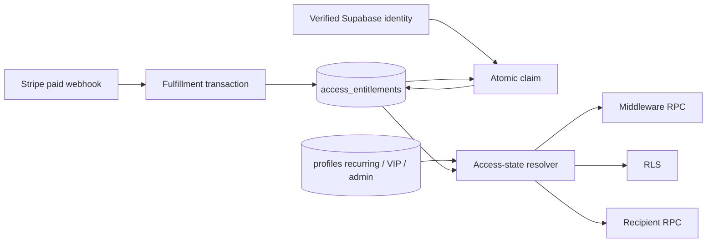

# Architecture Spine — PROCONTENT Temporary One-Time Access

## Design Paradigm

The DB access-state resolver is the Policy Decision Point. Middleware, RLS and email recipient selection are Policy Enforcement Points and may only consume its decision.



## Invariants & Rules

### AD-1 — Separate billing and entitlement lifecycles [ADOPTED]

- **Binds:** all temporary-offer fulfillment and access enforcement.
- **Prevents:** one-time payment masquerading as a subscription.
- **Rule:** one-time flow writes only its entitlement/audit domain and never mutates Stripe Subscription or `stripe_subscription_id`, `subscription_status`, `current_period_end`, price, interval or renewal state.

### AD-2 — Webhook-authoritative fulfillment [ADOPTED]

- **Binds:** payment events and entitlement creation.
- **Prevents:** access from redirects, client state, unknown payments or retries.
- **Rule:** after signature verification, fulfillment retrieves the Checkout Session server-side with expanded `line_items`; only a paid `mode='payment'` Session matching the exact server allowlist of Link, Price, metadata, amount, currency and quantity enters one transaction. `checkout.session.completed` qualifies only with `payment_status='paid'`; otherwise delayed success qualifies through `checkout.session.async_payment_succeeded`. `paid_at` is that qualifying event's `event.created`, so delivery order between unlike/non-qualifying events cannot select it. Unique Session ID makes retries no-op.

### AD-3 — One immutable grant per offer and purchaser [ADOPTED]

- **Binds:** entitlement schema and duplicate handling.
- **Prevents:** stacking or extending access through another Session.
- **Rule:** append-only `payment_fulfillment_attempts` records every qualifying or exception Session with immutable disposition and never participates in access. `access_entitlements` contains only grants and has a DB unique key on `(offer_code, purchaser_email_normalized)`. The first atomic `INSERT ... ON CONFLICT DO NOTHING` that occupies this key is the authoritative winner; later distinct Sessions are `duplicate_review` attempts and cannot replace or extend it. An `unclaimed` entitlement is a payment candidate, not access.
- **Rule:** mutable refund lifecycle is owned only by `payment_refund_cases`, uniquely linked to a non-granting attempt; refund updates never mutate attempt or entitlement records.
- **Rule:** canonical purchaser identity is retrieved `Checkout Session.customer_details.email`, normalized once with `lower(btrim())`; missing email is a non-granting exception. Metadata, redirect and PaymentIntent email cannot substitute it.

### AD-4 — Calendar expiry in Europe/Ljubljana [REQUIRES APPROVAL]

- **Binds:** `paid_at`, `access_starts_at`, `access_ends_at`.
- **Prevents:** 90-day substitution and DB timezone drift.
- **Rule:** `paid_at` is the first accepted Stripe paid-event timestamp; `access_starts_at = paid_at`; `access_ends_at` is persisted from explicit Europe/Ljubljana wall-clock `+ interval '3 months'`. Access uses `[access_starts_at, access_ends_at)` and is false at the exact deadline.

### AD-5 — Verified-email claim [ADOPTED]

- **Binds:** auth confirmation and authenticated payment return.
- **Prevents:** claim by redirect possession or unverified email.
- **Rule:** atomic server-side claim attaches only a webhook-issued `unclaimed` entitlement to `auth.uid()` whose confirmed email matches `lower(btrim(email))`. No provider-specific alias normalization. Session ID is a UX hint, never proof.
- **Rule:** new purchasers return through register/email verification; existing verified purchasers return through login/authenticated payment return. Both call the same claim contract. Missing webhook state yields a retryable pending UX, never redirect-derived access.

### AD-6 — Canonical access-state resolver [ADOPTED]

- **Binds:** middleware, RLS, email selection and cache.
- **Prevents:** incompatible access rules across enforcement surfaces.
- **Rule:** the private resolver returns `has_access`, `sources[]`, `valid_until`, `evaluated_at`. Canonical ordered identifiers are `admin`, `vip`, `recurring`, `temporary_one_time`, without duplicates or PEP-defined priority. `has_access=false` yields `valid_until=evaluated_at`; any admin/VIP/recurring source yields `valid_until=NULL`; time-limited-only access yields the maximum active `access_ends_at`.
- **Rule:** RLS calls authenticated-only no-argument `public.has_current_content_access()`, whose definer body supplies `auth.uid()` and DB time to the private core. Middleware calls authenticated-only no-argument `public.get_my_content_access_state()`, returning exactly one row: `has_access boolean NOT NULL`, `sources text[] NOT NULL`, `valid_until timestamptz NULL`, `evaluated_at timestamptz NOT NULL`. A service-role-only RPC serves email selection. Email applies preferences and adds temporary users without changing the existing VIP/admin audience.
- **Rule:** private helpers use schema-qualified names and `search_path=''`; public wrappers accept no arbitrary user ID; grants expose only the least required execution surface; clients cannot mutate entitlements.
- **Rule:** the PEP audit covers protected posts/media/comments/likes, like/comment mutations, `toggle_like` and other content RPC, protected Storage objects, views and public definer functions. Separate anonymous policies may expose only explicit public preview/avatar/site assets and never protected content/engagement data. Profile exposure cannot reveal authorization/payment fields.

### AD-7 — Deadline-bounded middleware cache

- **Binds:** signed access cache.
- **Prevents:** cached access beyond entitlement expiry.
- **Rule:** token wire shape uses canonical `sources` and `valid_until_epoch: integer|null`, where the integer is Unix time in whole UTC seconds. Lifetime is `min(configured_ttl, valid_until - now)` and evaluation rejects a reached deadline. `NULL` means no entitlement-bound deadline, never infinite cache; configured short TTL still applies.

### AD-8 — Server-time offer switch and non-revoking rollback [ADOPTED]

- **Binds:** pricing UI, redirect gate, webhook eligibility and rollback.
- **Prevents:** stale-client sales and entitlement revocation at campaign end.
- **Rule:** one server-only `TemporaryOfferConfig` owns the time window, timezone, offer identity, Link/Price IDs, amount/currency/quantity and metadata. It loads exactly one explicit `test` or `live` namespace and fail-closed rejects mixed/missing key/ID/link configuration; UI, redirect, webhook and rollback consume it without duplicated constants.
- **Rule:** server time selects temporary mode only in `[2026-09-01T00:00:00+02:00, 2026-12-01T00:00:00+01:00)`. Authenticated active/trialing recurring users and an existing grant do not receive the Link; former subscribers may. The original recurring UI/checkout contract remains intact.
- **Rule:** eligibility is app-level: a saved/shared direct Link can bypass the redirect gate, but its ineligible/duplicate payment never grants and requires the approved refund/support path. Temporary UI is one card without recurring selector, monthly math, cancellation/autorenewal language or publication-frequency promise.
- **Rule:** at cutoff the app returns recurring UI/checkout and stops issuing the Link; Owner deactivates the Link. A post-cutoff delivery grants only when its qualifying event timestamp is in-window; a new async success after cutoff is out-of-window and enters refund handling. Existing entitlements continue to their own deadline.

### AD-9 — Observable failures and executable rollback

- **Binds:** NFR18/NFR19, exception reconciliation and cutoff operations.
- **Prevents:** silent lost payments and rollback without evidence.
- **Rule:** transient fulfillment failures remain retryable and log safe event/session IDs; business exceptions persist as immutable non-granting attempts. Separate `payment_refund_cases` owns `refund_pending -> refunded | refund_failed_manual`, always without access, with Session-derived idempotency key. Production stays disabled until Owner/PM approves executor, SLA and communication.
- **Rule:** Owner is Accountable, a preassigned Operations operator is Responsible, and DEV is technical escalation for rollback. App cutoff runs before Link deactivation; evidence and smoke checks cover recurring checkout, subscriptions and continuing entitlements. Go/no-go requires controlled payment/claim/PDP/PEP smoke and rollback rehearsal; fulfillment 5xx, resolver mismatch or refund backlog closes only the temporary redirect gate and alerts.

### AD-10 — Trusted authorization inputs

- **Binds:** profile mutations, resolver integrity, RLS/GRANT migration.
- **Prevents:** self-service escalation to admin/VIP/active subscription.
- **Rule:** authenticated UPDATE grants name only safe self-service profile columns. `role`, `is_vip`, recurring Stripe/status fields, entitlement and fulfillment fields are trusted-server/service-role only; existing user-client reconciliation writes move behind that boundary before resolver rollout.
- **Rule:** entitlement/attempt tables have RLS enabled, no `anon/authenticated` table privileges, service-role runtime DML without DELETE, and no public function execution by default. The public self-state RPC is no-argument/authenticated-only; recipient and exception RPCs are service-role-only; private core resolver is not executable by `PUBLIC/anon/authenticated`.

## Consistency Conventions

| Concern | Convention |
| --- | --- |
| Email identity | `lower(btrim(email))`; no provider-specific equivalence |
| Time | `timestamptz` persistence; explicit `Europe/Ljubljana` calendar arithmetic; half-open intervals |
| Idempotency | Checkout Session ID is the primary fulfillment key; Payment Intent and Stripe event IDs are audit constraints |
| Authorization | Resolver is the only access policy; PEPs do not inspect raw subscription/entitlement fields |
| Mutations | Stripe webhook fulfills; verified authenticated server flow claims; browser clients never mutate entitlements |
| Errors | Unknown, ineligible, duplicate and late payments fail closed for access and retain safe audit context |

## Stack

| Name | Version |
| --- | --- |
| Next.js | 16.3.3 required; current 16.1.6 is launch-blocked |
| React | 19.2.3 |
| `stripe` | 20.4.1 |
| `@supabase/supabase-js` | 2.98.0 |
| `@supabase/ssr` | 0.9.0 |
| PostgreSQL / self-hosted Supabase | existing project runtime |

## Structural Seed

```text
Stripe paid event
  -> signed webhook adapter
    -> one-time fulfillment transaction
      -> access_entitlements
verified auth flow
  -> atomic claim
access-state resolver
  -> middleware RPC
  -> RLS policies
  -> service-role recipient RPC
```

## Capability → Architecture Map

| Capability / Area | Lives in | Governed by |
| --- | --- | --- |
| One-time payment fulfillment | signed Stripe webhook + DB transaction | AD-1, AD-2, AD-3 |
| Three-month grant | `access_entitlements` | AD-3, AD-4 |
| Identity claim | verified server auth flow | AD-5 |
| Content access | private resolver + PEP wrappers | AD-6, AD-7 |
| Temporary pricing window | server offer configuration and redirect gate | AD-8 |
| Email recipients | service-role resolver wrapper + preference overlay | AD-6 |
| Rollback | server cutoff + Stripe Link operation | AD-8 |
| Failure/reconciliation | retryable webhook + exception review surface | AD-9 |
| Authorization integrity | column grants + trusted server mutation boundary | AD-10 |

## Deferred / Separate Approval

- Exact test/live Stripe Link, Price, metadata, amount, currency, quantity and payment-method allowlist.
- Approval of migration SQL that implements the fixed two-table schema, uniqueness, resolver/RPC privileges and full RLS/GRANT inventory.
- Refund/support policy for direct ineligible, duplicate and after-cutoff delayed payments.
- Final Stripe timestamp mapping for `paid_at` and DST/month-end fixtures.
- VIP/admin purchase eligibility; fail closed until decided.
- Slovenian offer/post-payment/inactive copy.
- Payment Link deactivation owner, automation/runbook, evidence and fallback.
- GDPR/payment-record retention and redaction for purchaser email and exceptions.
- Major-change approval by Owner/PM and Architect before downstream documentation, code, Stripe, Supabase or tracker changes.
- Dependency approval and verification to move current Next.js 16.1.6 to patched Active LTS 16.3.3 or newer before implementation/launch.
