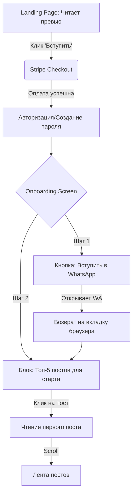
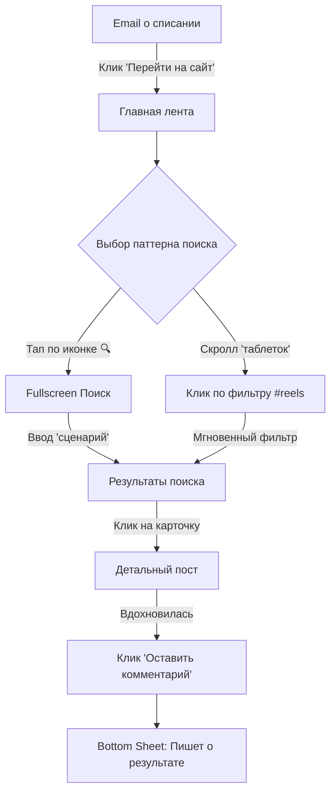
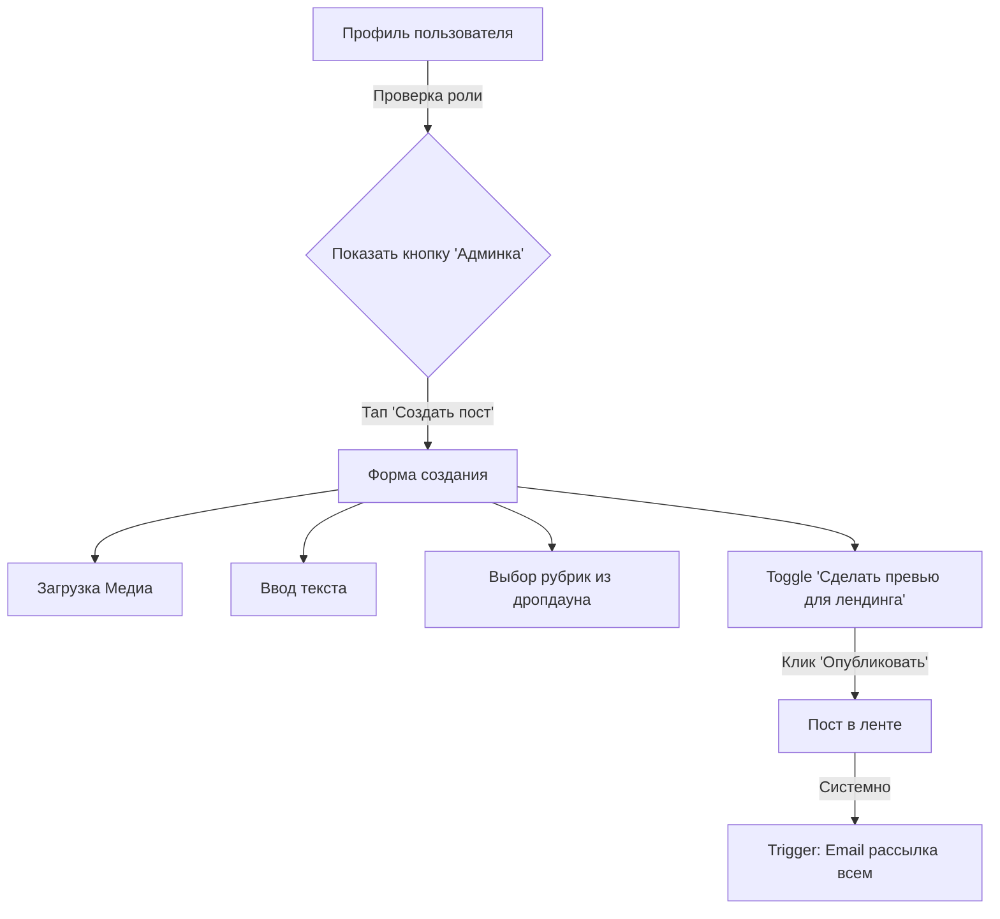

# UX Design Specification PROCONTENT

**Author:** Alex
**Date:** 2026-03-06

---

<!-- UX design content will be appended sequentially through collaborative workflow steps -->

## Executive Summary

### Project Vision

PROCONTENT — это закрытая платная веб-платформа (SPA) для словенских создательниц контента, объединяющая экспертные знания, живое общение и оффлайн-встречи. Продукт решает проблему хаотичности и изоляции, характерную для Telegram-каналов, создавая структурированное, безопасное и культурно близкое пространство. Главная ценность продукта — чувство принадлежности к профессиональному комьюнити и понятная навигация по базе знаний, а также полная автоматизация подписок (Stripe) для автора.

### Target Users

1. **Анна (Первичная аудитория):** 22–30 лет, начинающая креаторка/UGC. Потребляет контент со смартфона. Чувствует себя одиноко в своем увлечении, нуждается в пошаговой поддержке, базовых знаниях и поддерживающем комьюнити.
2. **Мария (Вторичная аудитория):** 25–35 лет, опытная креаторка. Ищет профессиональный нетворкинг, продвинутые инсайты по алгоритмам Instagram и выход на бренды.
3. **Лена (Вторичная аудитория):** 25–40 лет, владелица малого бизнеса. Хочет научиться самостоятельно снимать качественный контент для своего бренда, экономя на SMM.
4. **Автор / Администратор:** Создательница платформы, которой нужен удобный интерфейс для публикации контента разных форматов, управления рубриками и мониторинга оплат без рутины.

### Key Design Challenges

- **Mobile-First лента контента:** Создание плавного и интуитивно понятного скролла ленты (в стиле Instagram/TikTok) в рамках мобильного браузера, с поддержкой различных форматов (текст, видео, фото) без потери производительности.
- **Бесшовный Onboarding:** Быстрое снятие "тревожности чистого листа" у новых участниц путем немедленного вовлечения (Топ-5 постов) и перенаправления в WhatsApp-чат для формирования чувства сопричастности.
- **Навигация по огромному архиву:** Решение "проблемы Telegram" — проектирование удобных, всегда доступных фильтров (sticky "таблетки" рубрик) и поиска, чтобы пользователи легко находили нужный контент среди 2-летнего архива.
- **Публичная зона (Лендинг):** Проектирование высококонверсионной страницы для незарегистрированных пользователей с превью-постами и интеграцией Stripe.
- **Admin Dashboard:** Создание простого интерфейса для автора (публикация, превью, управление Stripe-статусами).

### Design Opportunities

- **Геймификация и визуализация статуса:** Использование бейджей достижений, прогресс-баров и ролей (новичок, опытный) в профиле пользователя для стимулирования retention и гордости за принадлежность к клубу.
- **Гибридное потребление контента:** Разделение опыта на сфокусированное чтение (детальная страница поста с ветками комментариев) и быстрое сканирование (лента превью с фильтрами по рубрикам, например `#insight`).
- **Высококонверсионный Landing Page:** Использование реальных превью-постов и социальных доказательств (отзывов) для создания доверия у незарегистрированных посетителей, приходящих из Instagram, с минимальным трением при оплате через Stripe.

## Core User Experience

### Defining Experience

Основной опыт взаимодействия строится вокруг бесшовного перехода от скроллинга контента к социальной вовлеченности. Для Анны (нашей основной персоны) процесс нахождения решения её проблемы должен напоминать привычный паттерн листания соцсетей, но с нулевым уровнем "информационного шума" и 100% концентрацией пользы. Вторичный фокус — на мгновенном получении поддержки от комьюнити (бесшовный переход в WhatsApp или ветку комментариев).

### Platform Strategy

- **Mobile-First SPA:** Интерфейс проектируется в первую очередь под экраны смартфонов (от 375px), учитывая паттерны управления большим пальцем одной руки (Bottom Navigation, свайпы).
- **Гибридный рендеринг:** Публичные страницы (лендинг, превью) оптимизированы для быстрой загрузки (SSR/SSG) и SEO для привлечения трафика из Instagram, в то время как закрытая зона работает как плавный SPA.
- **Отказ от нативных приложений в MVP:** Веб-приложение должно мимикрировать под нативное (отсутствие прыжков при переходе между вкладками, использование кэширования для создания ощущения мгновенного отклика).

### Effortless Interactions

- **Навигация в 1 клик:** Горизонтальный скролл sticky-"таблеток" с рубриками, позволяющий отфильтровать 2-летний архив без перехода на отдельную страницу.
- **Интеграция с WhatsApp:** Переход из онбординга или профиля прямо в чат комьюнити одним тапом.
- **Оплата и управление подпиской:** Использование Stripe Customer Portal для отмены/продления подписки без необходимости общаться с поддержкой платформы.

### Critical Success Moments

- **Первые 3 минуты (Onboarding):** Новая участница должна за первые 3 минуты понять структуру клуба, прочитать первый "пост для новичка" и вступить в WhatsApp-чат, почувствовав себя частью "своей стаи".
- **Момент "Aha!":** Нахождение конкретного практического совета (через поиск или фильтр) и его успешное применение "сегодня вечером".
- **Социальное признание:** Получение ответа от Автора или опытных креаторов на свой комментарий.
- **Конверсия:** Момент, когда незарегистрированный пользователь понимает ценность из превью-поста на лендинге и совершает импульсивную покупку.

### Experience Principles

- **Паттерны соцсетей важнее инноваций интерфейса:** Используем знакомые паттерны Instagram/TikTok (ленты, истории-подобные форматы для превью), чтобы не заставлять Анну переучиваться.
- **Геймификация без давления:** Поощрять вовлеченность (бейджи, прогресс), но не наказывать за неактивность (платформа должна быть полезным инструментом, а не "еще одной обязанностью").
- **Никаких "глухих стен" (Dead Ends):** Каждый экран должен предлагать следующее действие (после прочтения поста — похожие по теме или призыв к обсуждению).
- **Автоматизация рутины (для Автора):** Интерфейс администратора должен быть столь же простым и понятным, как публикация поста в личный блог.

## Desired Emotional Response

### Primary Emotional Goals

Главная эмоция, которую должен вызывать PROCONTENT — это **уверенность через принадлежность** (Empowered Belonging). Пользователь должен чувствовать: "Я не одна, я в правильном месте, и здесь мне понятно, что делать дальше". Платформа должна ощущаться как уютное, но профессиональное пространство ("уютная кофейня для своих", а не "холодный лекционный зал").

### Emotional Journey Mapping

- **Знакомство (Лендинг):** Доверие и облегчение ("Наконец-то кто-то говорит на моем языке и понимает мои проблемы").
- **Сразу после оплаты (Onboarding):** Радостное предвкушение и ясность ("Меня тут ждали, я знаю, с чего начать").
- **Потребление контента (Core Action):** Сфокусированность и инсайт ("Никакой воды, только польза, хочу попробовать это сегодня").
- **Взаимодействие (Комментарии/WhatsApp):** Сопричастность и безопасность ("Я могу задать глупый вопрос, и меня не осудят").
- **Возвращение на платформу:** Спокойствие ("Если я что-то забыла, я легко это найду в архиве").

### Micro-Emotions

- **Уверенность (вместо Растерянности):** Достигается за счет четких инструкций (Топ-5 постов) и отсутствия бесконечного неструктурированного скролла.
- **Признание (вместо Невидимости):** Достигается за счет геймификации в профиле (статусы, бейджи) и видимости автора в комментариях.
- **Спокойствие (вместо FOMO):** Пользователь не должен бояться пропустить контент (как в Telegram). Фильтры и поиск дают эмоцию контроля над базой знаний.

### Design Implications

- **Уверенность через принадлежность:** Использование теплой, дружелюбной типографики и микрокопирайтинга (Tone of Voice: "Привет, мы тебе рады", а не "Пользователь успешно авторизован").
- **Спокойствие:** Использование обильного "воздуха" (white space) в интерфейсе, чтобы отделить единицы контента друг от друга и снизить когнитивную нагрузку.
- **Признание:** Аватарки пользователей в комментариях и визуальное отображение их статуса (новички/опытные) для укрепления социальных связей.
- **Сфокусированность:** Отсутствие всплывающих окон, баннеров и агрессивных up-sell предложений внутри платной зоны.

### Emotional Design Principles

- **Безопасность важнее статусности:** Интерфейс должен поощрять вопросы и участие, не создавая иерархии, где новички боятся писать (эмоционально безопасная среда).
- **Празднование малых побед:** Визуальное подкрепление простых действий (например, приятная микроанимация при сохранении поста или написании первого комментария).
- **Прозрачность как основа доверия:** Предельно ясный интерфейс управления подпиской Stripe (без "спрятанных" кнопок отмены).

## UX Pattern Analysis & Inspiration

### Inspiring Products Analysis

- **Instagram / TikTok:** Главный источник вдохновения для ленты контента. Пользователи привыкли к бесконечному вертикальному скроллу, акценту на визуальную составляющую (крупные карточки, автовоспроизведение видео) и быстрым социальным реакциям (лайк по двойному тапу).
- **YouTube (Mobile):** Отличный референс для реализации навигации по архиву. Верхняя панель с горизонтально скроллящимися "таблетками" (фильтрами) позволяет быстро переключаться между темами без ухода с главного экрана.
- **Substack / Medium:** Вдохновение для детальных страниц текстовых постов. Чистая, акцентная типографика, много "воздуха", фокусировка исключительно на тексте без отвлекающих элементов по бокам.

### Transferable UX Patterns

**Navigation Patterns:**
- **Bottom Navigation Bar (Mobile):** Классический паттерн из 3-4 иконок (Лента, Поиск/Архив, Профиль) для мгновенного доступа к ключевым разделам одной рукой.
- **Sticky Pill Filters:** Закрепленные при скролле горизонтальные теги рубрик (например, `#insight`, `Разборы`) прямо над лентой.

**Interaction Patterns:**
- **Skeleton Loading:** Использование скелетной загрузки вместо крутящихся спиннеров для создания ощущения мгновенной работы приложения (мимикрия под натив).
- **Бесшовный переход к обсуждению:** Показ 1-2 самых популярных комментариев прямо в карточке поста (как в Instagram), чтобы стимулировать желание зайти в ветку и ответить.

**Visual Patterns:**
- **Аватарки как индикатор статуса:** Использование визуальных рамок или микро-бейджей рядом с аватаром (вдохновлено обводкой Stories в Instagram) для отображения статуса участницы (Новичок, Опытная).

### Anti-Patterns to Avoid

- **"Эффект Telegram" (Хронологическая свалка):** Отсутствие визуального разделения между разными типами контента. Мы должны четко выделять форматы (большая статья vs короткая заметка) на уровне UI карточки.
- **Бургер-меню (Hamburger Menu) на мобильных:** Скрытие важной навигации в выезжающем сбоку меню. Вся основная навигация должна быть в нижнем таб-баре.
- **Всплывающие окна (Pop-ups):** Использование модальных окон, прерывающих чтение (кроме критичных системных уведомлений или процесса оплаты).
- **Многоуровневая вложенность:** Заставлять пользователя делать более 2 тапов, чтобы добраться до нужного контента (например, прятать рубрики глубоко в профиле).

### Design Inspiration Strategy

**What to Adopt:**
- Паттерн ленты Instagram для главного экрана (снижает когнитивную нагрузку на обучение интерфейсу).
- Фильтры-таблетки из YouTube для категоризации (решает главную боль потери контента в архиве).

**What to Adapt:**
- Паттерн комментариев: адаптируем его под более вдумчивые обсуждения (древовидная структура), а не просто быстрые реакции.
- Профиль пользователя: превращаем его из "витрины для других" в "доску личных достижений и настроек".

**What to Avoid:**
- Полностью избегаем сложных дашбордов и табличного отображения информации.

## Design System Foundation

### Design System Choice

**Next.js (App Router) + Tailwind CSS v4 + shadcn/ui**
PROCONTENT реализован как Next.js SPA с App Router, Tailwind CSS v4 (с `@import 'tailwindcss'`), и headless-компонентами shadcn/ui. Стилизация использует CSS-переменные в формате `oklch()` для точного управления цветом. Проект осознанно отказывается от тяжеловесных готовых UI-библиотек (вроде Material Design или Ant Design).

### Rationale for Selection

- **Уникальный editorial/fashion вид:** Вместо стандартного "уютного" интерфейса реализован модный editorial стиль — condensed uppercase sans-serif для UI, контрастный serif для заголовков, обильный letter-spacing. Tailwind позволяет точно выстроить этот визуальный язык без борьбы с готовыми UI-фреймворками.
- **Скорость для соло-разработчика:** shadcn/ui даёт готовые, доступные (accessible) базовые элементы (Button и др.), которые копируются в проект и стилизуются под наши нужды за минуты.
- **Производительность (Performance):** Zero-runtime CSS (Tailwind v4) и минимальный размер бандла критически важны для достижения наших нефункциональных требований (NFR): LCP ≤ 2.5 сек и TTI ≤ 4 сек на мобильных устройствах с 3G-сетью.

### Implementation Approach

- **Mobile-First Breakpoints:** Разработка базовых стилей ведется строго под мобильные экраны (375px/390px). Десктопная версия (от 768px и выше) реализуется через прогрессивное улучшение.
- **Токены дизайна (Design Tokens):** CSS-переменные в формате `oklch()` (например, `--primary: oklch(0.56 0.1 35)`) для управления цветами, `--radius` для скруглений, `--font-sans` и `--font-heading` для типографики. Поддержка светлой и тёмной тем через класс `.dark`.
- **Утилитарные CSS-хелперы:** `.scrollbar-hide` для скрытия скроллбара в горизонтальных фильтрах, `.pb-safe` для safe area на устройствах с вырезом.

### Customization Strategy

- **Типографика (реализовано):**
  - **UI / Body:** `Barlow Condensed` (Google Fonts) — condensed sans-serif с weights 300–700. Используется для кнопок, навигации, мелкого текста. Все UI-элементы — `uppercase` с `tracking-[0.15em]`–`tracking-[0.3em]`.
  - **Headings / Editorial:** `Cormorant Garamond` (Google Fonts) — элегантный контрастный serif с тонкими/толстыми штрихами. Используется для крупных заголовков на лендинге и в карточках контента. Weights: 300 (light) — 700 (bold).
  - Оба шрифта подключены через `next/font/google` с `display: 'swap'` и поддержкой подмножества `cyrillic`.
- **Микро-взаимодействия (Micro-interactions):** CSS-транзиции `transition-colors` на кнопках и интерактивных элементах. Hover-эффекты через полупрозрачные состояния (`hover:bg-primary/10`, `hover:bg-primary/20`).
- **Специфичные компоненты:** Кастомная реализация Bottom Navigation Bar (`MobileNav`), горизонтальных фильтров-таблеток (`CategoryScroll`) и карточек контента (`PostCard`).

## 2. Core User Experience

### 2.1 Defining Experience

**"Найти инсайт, применить, обсудить со своими."**
Ключевой опыт PROCONTENT — это комбинация привычного потребления контента (лента Instagram) со структурированностью базы знаний и ощущением закрытого клуба. В отличие от Telegram, где старый полезный контент "умирает" под лавиной новых сообщений, здесь пользователь может в один клик отфильтровать 2-летний архив и мгновенно перейти к обсуждению найденного материала.

### 2.2 User Mental Model

**Как пользователи мыслят сейчас:**
- *Паттерн соцсетей:* Привыкли к быстрому, вертикальному скроллу и визуальному контенту (Instagram, TikTok).
- *Паттерн обучения:* Привыкли, что курсы и полезные материалы находятся на скучных платформах (Kajabi, GetCourse), куда нужно специально "заставлять" себя заходить.
- *Паттерн общения:* Telegram-каналы, где всё свалено в одну кучу: и важные анонсы, и полезные посты, и флуд в комментариях. Найти что-то старое — боль.

**Наше решение:** Мы берем паттерн соцсетей (лента) и накладываем его на премиальный образовательный контент, убирая хаос с помощью "таблеток" фильтрации.

### 2.3 Success Criteria

- **Скорость поиска ценности:** Пользователь может найти пост на конкретную тему (например, выбрав рубрику `#insight`) менее чем за 3 секунды после входа.
- **Бесшовность вовлечения:** Переход от чтения поста к чтению/написанию комментария занимает ровно 1 тап (без загрузки новых тяжелых страниц).
- **Социальное подтверждение:** Моментальное визуальное отображение оставленного комментария с аватаром и бейджем статуса участницы.

### 2.4 Novel UX Patterns

Мы **не используем** принципиально новые (novel) UX-паттерны, требующие обучения. Наша инновация заключается в комбинации:
Мы берем **установленные паттерны** (Bottom Navigation, бесконечный скролл, Sticky Pill Filters из YouTube) и применяем их к платному образовательному комьюнити. Это снижает когнитивную нагрузку Анны до нуля — она интуитивно понимает, как пользоваться платформой с первой секунды.

### 2.5 Experience Mechanics

**Механика ключевого взаимодействия (Поиск и Обсуждение):**

1. **Initiation (Начало):** Пользователь открывает платформу и видит хронологическую ленту постов. Сверху закреплена панель с рубриками ("Все", "Тема месяца", "Разборы").
2. **Interaction (Взаимодействие):** Пользователь тапает на таблетку "Разборы".
3. **Feedback (Отклик системы):** Мгновенно (без перезагрузки всей страницы, используя Skeleton Loading) лента фильтруется, оставляя только нужные карточки постов.
4. **Deep Dive (Погружение):** Пользователь тапает на иконку "Комментарии" 💬 в футере заинтересовавшей карточки. Снизу плавно выезжает панель (Bottom Sheet) или открывается экран с обсуждением.
5. **Completion (Завершение):** Пользователь отправляет свой комментарий. Он появляется мгновенно (Optimistic UI update), сопровождаемый легкой микро-анимацией, давая чувство завершенности и сопричастности к дискуссии.

## Visual Design Foundation

### Color System

**Концепция: "Тёплый минимализм" (Warm Minimalism) — реализовано в oklch()**
Палитра передаёт ощущение премиальности и фокуса на контенте, не перетягивая внимание.

- **Background (Фоны):** Тёплый кремовый `oklch(0.993 0.006 90)` (~`#FDFBF7`) — отказ от чистого белого `#FFFFFF`. Создаёт ощущение "бумаги".
- **Primary Accent:** Muted Terracotta `oklch(0.56 0.1 35)` — приглушенный терракотовый. Используется для акцентных элементов: активные фильтры-таблетки, бейджи рубрик, состояние лайка, ring/focus.
- **Foreground (Текст):** Dark Charcoal Warm `oklch(0.22 0.01 60)` (~`#2C2924`) — тёплый тёмно-серый вместо чистого `#000`.
- **Muted Foreground:** `oklch(0.52 0.012 60)` — для вторичного текста (даты, подписи, placeholder).
- **Borders:** `oklch(0.91 0.01 80)` — тёплые тонкие линии отделения.
- **Destructive:** `oklch(0.58 0.18 27)` — мягкий красный для ошибок валидации.
- **Dark Theme:** Поддержка через класс `.dark` с нейтральными oklch-значениями (grayscale). Primary в тёмной теме — стандартный светлый `oklch(0.87 0 0)`.

**Инверсные зоны лендинга:** Hero-секция и CTA-секция используют `bg-foreground` (тёмный фон), создавая драматический контраст. Текст переключается на `text-primary-foreground`. Акцентный цвет для мелких лейблов: `oklch(0.75 0.1 35)` (инлайн style).

### Typography System

- **Primary Typeface (UI & Body): Barlow Condensed** — condensed sans-serif от Google Fonts. Weights: 300–700. Подмножества: `latin`, `latin-ext`. CSS-переменная: `--font-sans`.
  - Применение: все UI-элементы, кнопки (`.font-sans text-xs tracking-[0.2em] uppercase`), мелкий текст (`.text-xs tracking-[0.1em] uppercase`), лейблы.
  - Характер: модный, "fashion", вытянутый — создаёт ощущение editorial/magazine.
- **Secondary Typeface (Headings): Cormorant Garamond** — контрастный serif от Google Fonts. Weights: 300–700. Подмножества: `latin`, `cyrillic`. CSS-переменная: `--font-heading`.
  - Применение: крупные заголовки на лендинге (`.font-serif`), заголовки в карточках постов (`.font-heading`).
  - Характер: элегантный, утончённый, с контрастом тонких и толстых штрихов.
- **Иерархия (реализованные размеры):**
  - H1 (Hero): `clamp(3rem, 12vw, 6rem)` — `font-light leading-none uppercase`
  - H2 (Секции): `clamp(2rem, 8vw, 3.5rem)` — `font-light leading-none uppercase`
  - H2 CTA: `clamp(2.5rem, 10vw, 5rem)` — `font-light leading-none uppercase`
  - Заголовки карточек: `text-base font-semibold leading-snug` (font-heading)
  - Body text: `text-sm leading-relaxed`
  - UI labels: `text-xs tracking-[0.15em]–[0.3em] uppercase`
  - Nav labels: `text-[10px] font-medium tracking-wide`

### Spacing & Layout Foundation

- **Базовая сетка (4/8pt Grid):** Отступы через Tailwind: `gap-1` (4px), `gap-2` (8px), `gap-3` (12px), `gap-4` (16px), `gap-6` (24px), `gap-8` (32px). Внутренние отступы: `px-4`/`px-5` (16/20px), `py-5`/`py-16` (20/64px).
- **Контейнеры:** `max-w-xl` (36rem / 576px) для контентных секций лендинга. На мобильных — полная ширина с `px-5` (20px).
- **Воздух (White Space):** Секции лендинга — `py-16` (64px). Разделение карточек в ленте — через `border-b border-border` вместо возвышения (flat design). Карточки на лендинге — `rounded-2xl` (16px radius).
- **Скругления:** Базовый `--radius: 0.75rem` (12px). Используются производные: `radius-sm`…`radius-4xl`. Карточки: `rounded-2xl`. Аватары/бейджи: `rounded-full`. Inputs: `rounded-lg`.

### Accessibility Considerations

- **Контрастность:** Все текстовые элементы проходят проверку WCAG 2.1 Level AA (4.5:1+). Использование oklch обеспечивает перцептуально точный контроль контраста.
- **Touch Targets (реализовано):** Все интерактивные элементы используют `min-h-[44px] min-w-[44px]` — кнопки лайка, комментария, навигации, опций поста, фильтры, auth-формы.
- **ARIA-атрибуты (реализовано):** `aria-label` на навигации, кнопках, иконках. `aria-pressed` на фильтрах и лайках. `aria-current="page"` в навигации. `role="alert"` на сообщениях об ошибках. `aria-invalid` на формах.
- **Focus States:** `focus:ring-2 focus:ring-ring/50 focus:outline-none` на полях ввода. `outline-ring/50` глобально через `@layer base`.

## Design Direction Decision

### Design Directions Explored

В ходе планирования мы концептуально исследовали несколько направлений для отображения контента:
1. **"Классический блог"** — как Medium или Substack (текст-ориентированный).
2. **"Платформа онлайн-курсов"** — как Kajabi (жесткая структура, модули, уроки).
3. **"Социальная лента"** — как Instagram/TikTok (динамичный, визуальный, бесконечный скролл).

### Chosen Direction

**Направление "Социальная лента" (Social Feed Pattern) с фильтрацией из YouTube.**
Мы выбираем комбинацию привычной ленты постов (карточки, медиа на всю ширину, социальные кнопки внизу) с закрепленной панелью горизонтальных фильтров рубрик (Sticky Pill Filters) для управления архивом. 

### Design Rationale

- **Снижение когнитивной нагрузки:** Наша основная персона (Анна) потребляет контент в Instagram/TikTok. Используя тот же паттерн ленты, мы убираем необходимость обучать ее новому интерфейсу. Платформа сразу кажется "своей".
- **Визуальная вовлеченность:** В нише создания контента (SMM, UGC) визуальная составляющая (видео, фото до/после) важнее длинных текстов. Паттерн карточек с крупными превью решает эту задачу лучше всего.
- **Решение проблемы Telegram:** В отличие от мессенджера, где контент теряется, наше направление вводит жесткую категоризацию сверху ленты (фильтры), позволяя превратить 2-летний архив в полезную базу знаний без создания сложных дашбордов.

### Implementation Approach

- **Карточки контента (реализовано):** Компонент `PostCard` (`src/components/feed/PostCard.tsx`) — flat-дизайн с `border-b` разделителем. Включает header (аватар, имя, бейдж "Автор", категория, дата), контент (заголовок + excerpt), бейдж типа (Видео/Фото), footer (лайк + комментарий). Optimistic UI для лайков реализован через локальный state.
- **Skeleton Loading (реализовано):** `PostCardSkeleton` — компонент скелетонной загрузки с `animate-pulse`, повторяющий структуру PostCard (аватар, строки текста, кнопки).
- **Sticky Pill Filters (реализовано):** Компонент `CategoryScroll` (`src/components/feed/CategoryScroll.tsx`) — 7 рубрик: Все, #insight, #разборы, #съёмка, #reels, #бренды, Тема месяца. Active: `bg-primary text-primary-foreground`, Default: `bg-muted text-muted-foreground`. Скроллбар скрыт через `scrollbarWidth: 'none'`.
- **Micro-interactions:** `transition-colors` на всех интерактивных элементах. Hover-состояния через полупрозрачность (`hover:bg-primary/10`). Кнопка лайка переключает fill иконки-сердечка.

## User Journey Flows

### 1. Onboarding & First Value (Journey 1: Анна)
*Как новая участница попадает в клуб и получает первую ценность.*

**Оптимизация:** 
- Убираем лишние шаги заполнения профиля при регистрации (имя/аватар можно добавить позже).
- WhatsApp-ссылка дается *до* перехода в общую ленту, так как комьюнити — ядро продукта.

### 2. Targeted Search & Rescue (Journey 2: Анна — Edge Case)
*Как участница находит нужный ответ в архиве, когда хочет отменить подписку.*

**Оптимизация:**
- Фильтры ("таблетки") всегда на экране. Если пользователь не знает, как сформулировать запрос текстом, он просто тапает на готовую рубрику.
- Использование Skeleton-загрузки при фильтрации (без перезагрузки страницы).

### 3. Content Creation & Admin (Journey 3: Автор)
*Как основательница публикует контент.*

**Оптимизация:**
- Админка не вынесена на отдельный поддомен. Это просто скрытая вкладка в профиле, чтобы Автор мог управлять клубом прямо с телефона "на ходу".

### Journey Patterns
- **Floating Actions:** Ключевые действия (поиск, фильтры) всегда прилипают к краям экрана и не уезжают при скролле.
- **Bottom Sheets (Шторки):** Вместо открытия новых страниц для комментариев или настроек, используем всплывающие снизу панели. Это сохраняет контекст (пользователь видит, что лента осталась на фоне).

### Flow Optimization Principles
- **Progressive Disclosure:** Не вываливаем на Анну весь 2-летний архив сразу. Сначала Топ-5 (онбординг), затем лента, затем фильтры по мере возникновения потребности.
- **Optimistic UI:** Комментарии и лайки отображаются как "успешные" мгновенно, до получения ответа от сервера, чтобы интерфейс казался "летающим".

## Component Strategy

### Design System Components (shadcn/ui)

**Из shadcn/ui установлен:**
- **Button** (`src/components/ui/button.tsx`) — базовый компонент кнопки с вариантами. Однако в проекте кнопки преимущественно реализованы инлайн-стилями в editorial-стиле: `border border-primary px-8 py-3 font-sans text-xs font-medium tracking-[0.2em] uppercase` (outline-стиль с тонкой рамкой).

**Планируется установить по мере необходимости:**
- Dialog / Drawer, Skeleton (кастомный уже есть), Dropdown Menu, Avatar (реализован кастомно), Toast / Sonner.

### Custom Components (реализовано)

#### 1. Content Card — `PostCard` (`src/components/feed/PostCard.tsx`)
**Назначение:** Универсальная единица контента в ленте.
**Структура (реализована):**
- *Header:* Аватар (инициалы, `rounded-full bg-primary/20`) → Имя автора + бейдж "Автор" (`bg-primary/10 text-primary`) → Категория (`bg-muted rounded-full`) + дата → Кнопка опций (вертикальное троеточие, `min-h-[44px] min-w-[44px]`).
- *Content:* Заголовок (`font-heading text-base font-semibold text-balance`), превью текста (`text-sm text-muted-foreground line-clamp-3`).
- *Type Badge:* Иконка + текст "Видео" или "Фото" для не-текстовых постов.
- *Footer (Social):* Кнопка лайка (сердечко с Optimistic UI — переключение `fill`/`stroke`, `text-primary` при активации), Кнопка комментария (со счётчиком). Обе — `min-h-[44px] min-w-[44px]`.
**Props:** `PostCardData` (id, category, title, excerpt, date, likes, comments, author, imageUrl?, type).
**Skeleton:** `PostCardSkeleton` — `animate-pulse` скелетон, повторяющий анатомию карточки.

#### 2. Sticky Pill Filters — `CategoryScroll` (`src/components/feed/CategoryScroll.tsx`)
**Назначение:** Быстрая фильтрация архива постов.
**Рубрики (реализованы):** Все, #insight, #разборы, #съёмка, #reels, #бренды, Тема месяца.
**Стили:** Default: `bg-muted text-muted-foreground`, Active: `bg-primary text-primary-foreground`. Горизонтальный скролл без скроллбара. `min-h-[44px]` на каждой таблетке. `aria-pressed` для accessibility.

#### 3. Bottom Navigation Bar — `MobileNav` (`src/components/navigation/MobileNav.tsx`)
**Назначение:** Главная навигация для мобильного вида.
**Вкладки (реализованы):** Лента (`/feed`), Поиск (`/search`), Профиль (`/profile`). 3 иконки с двумя состояниями каждая (outline inactive / filled active).
**Стили:** `fixed bottom-0 z-20 border-t bg-background/95 backdrop-blur-sm pb-safe`. Active: `text-primary`, Inactive: `text-muted-foreground`. Каждый элемент: `min-h-[60px]`. `aria-label` на каждой ссылке, `aria-current="page"` на активной.

#### 4. Landing Sections (6 компонентов в `src/components/landing/`)

- **HeroSection:** Полноэкранный hero (`min-h-[100svh]`) с фоновым фото (`/images/hero-bg.png`) через `next/image`, overlay gradient (`from-foreground/20 via-foreground/40 to-foreground/80`), инвертированная тема (`bg-foreground`, `text-primary-foreground`). Заголовок PRO/CONTENT — `font-serif clamp(3rem,12vw,6rem)`. Две CTA-кнопки: outline primary + outline ghost.
- **BenefitsSection:** 4 карточки преимуществ (Lucide-иконки: BookOpen, Users, Zap, Archive). Заголовки: `font-serif text-xl uppercase`. Описания: `text-xs tracking-[0.1em] uppercase`.
- **PreviewPostsSection:** 3 превью-карточки контента (`rounded-2xl border bg-card p-5`). Открытый / заблокированный контент (gradient fade + badge "Для участниц" с иконкой замка). Social counters (лайки, комменты).
- **TestimonialsSection:** 3 отзыва в `<blockquote>` с аватарами-инициалами, бейджами статуса ("Опытная"/"Участница"), font-serif italic для цитат.
- **PricingSection:** Две карточки тарифов: **€12,99/месяц** и **€34/3 месяца** (≈€11,33/мес, экономия €4,97). Чек-лист (6 пунктов) общий для обоих планов. CTA: две outline primary кнопки → `/login` (Stripe Checkout — Story 1.4). ⚠️ Текущая реализация содержит ошибку (€29) — требует исправления.
- **CtaSection:** Финальная секция с инвертированной темой (`bg-foreground`), крупный заголовок serif, CTA-кнопка + ссылка "Уже участница? Войти".

#### 5. Auth Flow (реализован в `src/features/auth/`)

- **AuthContainer** (`src/features/auth/components/AuthContainer.tsx`): Классический контейнер авторизации. Интеграция с Supabase Auth (Email + Password). Включает в себя формы для логина, сброса пароля и установки нового пароля.
- **LoginForm**: Поля "Email" и "Пароль" с инлайн-валидацией. Кнопка логина. Присутствует текстовая ссылка "Забыли пароль?", ведущая на форму запроса сброса пароля.
- **UpdatePasswordForm**: Экран, на который участница попадает после перехода по ссылке-приглашению (первичное создание пароля) или ссылке восстановления. Подерживает поля "Новый пароль" и "Подтвердите пароль". Инлайн проверка на совпадение и минимальную длину (6 символов).
- **LoginPage** (`src/app/(public)/login/page.tsx`): Server-side проверка авторизации — если user уже авторизован, redirect на `/feed`. Содержит в себе `LoginForm`. Разметка: `min-h-screen items-center justify-center max-w-sm`.

#### 6. Comment Thread — DiscussionNode (не реализован)
**Статус:** Планируется в Phase 2.
**Описание:** Аватар, Бейдж статуса (Новичок/Автор), Имя, Текст, Кнопка "Ответить". Ограничение 1 уровня вложенности (flat list + padding).

### Component Implementation Strategy

1. **Стиль кнопок (editorial outline):** Все CTA-кнопки в проекте — outline-стиль: `border border-primary`, без заливки, текст `uppercase tracking-[0.2em]`. Hover: `bg-primary/10`. Это сознательный отход от «filled primary» для создания модного editorial-ощущения.
2. **Аватары:** Реализованы инлайн (без компонента Avatar из shadcn/ui) — `rounded-full bg-primary/20` с инициалами (`text-xs font-semibold text-primary`).
3. **Touch-Ready:** Все интерактивные элементы строго соблюдают `min-h-[44px] min-w-[44px]`.
4. **Абстракция логики:** `PostCard` — presentational component, получает данные через props. Auth-логика вынесена в `features/auth/`.

### Implementation Roadmap

**Phase 1 - Core (✅ реализовано)**
- ✅ `MobileNav` — навигация (3 вкладки)
- ✅ `PostCard` + `PostCardSkeleton` — карточка контента с Optimistic UI лайками
- ✅ `CategoryScroll` — фильтры-таблетки (7 рубрик)
- ✅ Landing Page — 6 секций (Hero, Benefits, PreviewPosts, Testimonials, Pricing, CTA)
- ✅ Auth Flow — email → OTP-код через Supabase
- ✅ Feed Page (placeholder) — заглушка с кнопкой выхода

**Phase 2 - Engagement (планируется)**
- `DiscussionNode` (Дерево комментариев)
- `Bottom Sheet` (Шторка для написания комментария / поиска)
- Полноценная Feed-страница с реальными данными

**Phase 3 - Admin & Growth**
- Форма создания поста (Admin)
- `UserBadge` / Статусы в профиле (Геймификация)
- Onboarding-экран после оплаты

## UX Consistency Patterns

### Button Hierarchy (реализовано)

В проекте принят **editorial outline** стиль кнопок вместо заливки:

- **Primary CTA (Главное действие):** Outline с рамкой акцентного цвета: `border border-primary px-8 py-3 font-sans text-xs font-medium tracking-[0.2em] uppercase`. Hover: `bg-primary/10`. Текст: `text-foreground` или `text-primary-foreground` (на тёмных секциях). *Примеры: "Вступить в клуб", "Вступить сейчас", "Получить код", "Войти".*
- **Secondary CTA:** Outline с полупрозрачной рамкой: `border border-primary-foreground/30 text-primary-foreground/60`. Hover: `border-primary-foreground/60`. *Пример: "Посмотреть превью" на Hero.*
- **Ghost/Icon Button:** Без фона и рамки, только иконка. `min-h-[44px] min-w-[44px] rounded-lg`. *Примеры: Сердечко (лайк), Иконка комментария, вертикальное троеточие (опции).*
- **Text Link:** `text-primary underline-offset-4 hover:underline`. *Пример: "Отправить повторно" в OTP-форме.*
- **Active Filter Pill:** `bg-primary text-primary-foreground rounded-full`. *Пример: активная таблетка в CategoryScroll.*
- **Touch Target:** `min-h-[44px] min-w-[44px]` на всех интерактивных элементах.

### Feedback Patterns (частично реализовано)

- **Optimistic Updates (реализовано):** Лайки в `PostCard` — мгновенная смена `fill`/`stroke` иконки сердечка + инкремент/декремент счётчика через локальный state.
- **Error Alerts (реализовано):** Сетевые ошибки auth — `border-destructive/20 bg-destructive/10 text-destructive rounded-lg border px-4 py-3` с `role="alert"`.
- **Inline Validation (реализовано):** Ошибки валидации полей — `text-destructive text-sm` под полем, `border-destructive` на input, `aria-invalid`.
- **Loading States (реализовано):** Кнопки: `disabled:opacity-50 disabled:pointer-events-none` + текст "Отправляем..."/"Проверяем...". Skeleton: `PostCardSkeleton` с `animate-pulse`.
- **Toast Notifications (планируется):** Sonner — для будущих уведомлений ("Ссылка скопирована", "Пост опубликован").

### Form Patterns (реализовано)

Формы сведены к абсолютному минимуму:

- **Авторизация (реализовано):** Классический логин через Email и Пароль. При первичной регистрации (после оплаты) пользователь получает ссылку-приглашение на email для создания безопасного пароля.
- **Инлайн-валидация (реализовано):** Проверка email через `validity.valueMissing` / `validity.typeMismatch`. Проверка длины пароля (мин. 6 символов) и совпадения при подтверждении. Автофокус на поле при ошибке.
- **Auth UX (реализовано):** При неудачном логине пароль не очищается, выводится понятное системное уведомление. `isLoading` сохраняется во время запроса авторизации до redirect (блокировка повторных нажатий). URL-ошибки обратного вызова (`?error=auth_callback_error` или сброса пароля) отображаются как alert.

### Navigation Patterns (реализовано)

- **Mobile Bottom Bar (реализовано):** `MobileNav` — `fixed bottom-0`, 3 вкладки (Лента, Поиск, Профиль). `backdrop-blur-sm bg-background/95` для полупрозрачности. `pb-safe` для устройств с вырезом.
- **Infinite Scroll (планируется):** Feed-страница пока в режиме заглушки.
- **BottomSheet Navigation (планируется):** Для комментариев и настроек.

### Additional Patterns

- **Empty States (частично реализовано):** Feed-страница: "Скоро здесь появится контент" + кнопка "Выйти". Полноценные empty states с графикой — планируется.
- **Server-Side Auth Guard (реализовано):** `(app)/layout.tsx` проверяет сессию Supabase, redirect на `/login` если не авторизован. `(public)/login/page.tsx` — redirect на `/feed` если уже авторизован.
- **Route Groups:** `(app)` — закрытая зона (требует auth), `(public)` — открытая зона (лендинг, логин).

## Responsive Design & Accessibility

### Responsive Strategy

**Mobile-First, Progressive Enhancement**
Поскольку 90%+ трафика (Анна) приходит из Instagram и потребляет контент на ходу, мы проектируем платформу строго под мобильные экраны (Mobile-First). Десктопная версия не является приоритетом для сложной переработки интерфейса — она должна просто не ломаться и быть удобной для автора (публикация контента) и изредка для пользователей, которые смотрят длинные видео с ноутбука.

- **Mobile (Core):** Интерфейс с нижним таб-баром (Bottom Navigation), карточки контента занимают всю ширину (100vw). Управление рассчитано на один большой палец.
- **Tablet / Small Desktop:** Карточки контента ограничиваются по максимальной ширине (например, `max-w-xl`), чтобы строки текста не становились слишком длинными для чтения (оптимально 60-80 символов).
- **Desktop:** Нижний таб-бар превращается в боковую навигационную панель (Sidebar), освобождая вертикальное пространство.

### Breakpoint Strategy

В соответствии с Tailwind CSS (стандартные брейкпоинты), но с акцентом на мобильные устройства:
- **Default (Mobile):** < 640px (от 375px) — Базовый дизайн, фокус на свайпы и тапы.
- **sm:** >= 640px — Для крупных планшетов. Центрирование контента, появление небольших отступов (margins) по краям ленты.
- **md:** >= 768px (Tablet Landscape) — Переход Bottom Navigation в Sidebar.
- **lg:** >= 1024px (Desktop) — Админ-панель для автора перестраивается в двухколоночный вид (слева форма, справа предпросмотр превью-поста).

### Accessibility Strategy

В соответствии с нашими NFR, мы целимся в уровень **WCAG 2.1 AA**, так как это золотой стандарт для современного веба.

- **Зрение (Visual):** Строгое соблюдение контраста текста (4.5:1). Никаких светло-серых шрифтов на белом фоне. Не полагаемся *только* на цвет для передачи информации (ошибки валидации должны иметь иконку + текст, а не просто красную рамку).
- **Моторика (Motor):** Touch Targets не менее 44x44px (требование Apple HIG / Android). Расстояние между интерактивными элементами (например, кнопками лайка и комментария) должно предотвращать случайные "промахи".
- **Когнитивная нагрузка:** "Теплый минимализм" и отсутствие мигающих баннеров снижает стресс. Skeleton загрузка снижает тревожность ожидания.

### Testing Strategy

- **Устройства:** Тестирование на реальных девайсах iOS (Safari) и Android (Chrome), а не только в Chrome DevTools (особенно важно для проверки работы Bottom Sheet на устройствах с "челкой" / Safe Area).
- **Сеть:** Тестирование скорости загрузки (LCP) с троттлингом до Fast 3G, чтобы гарантировать выполнение NFR1/NFR2.
- **Accessibility:** Использование Lighthouse / axe DevTools на этапе CI/CD для автоматической проверки контрастности и ARIA-атрибутов.

### Implementation Guidelines

- Разработчик (Amelia) должен использовать `rem` для всех шрифтов, чтобы они масштабировались в соответствии с системными настройками пользователя.
- Все SVG-иконки и изображения (NFR16) должны иметь `aria-label` или `alt` атрибуты (пустые `alt=""` для декоративных).
- Для десктопа: реализовать `:focus-visible` стили (например, outline кольцо акцентного цвета) для поддержки навигации с клавиатуры (NFR17).
