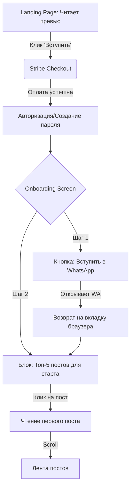
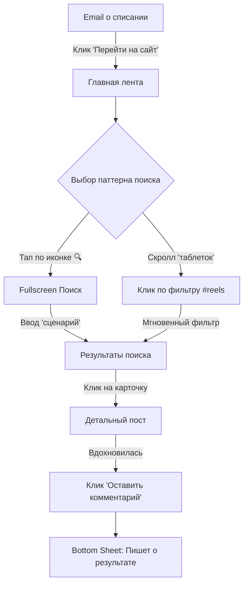
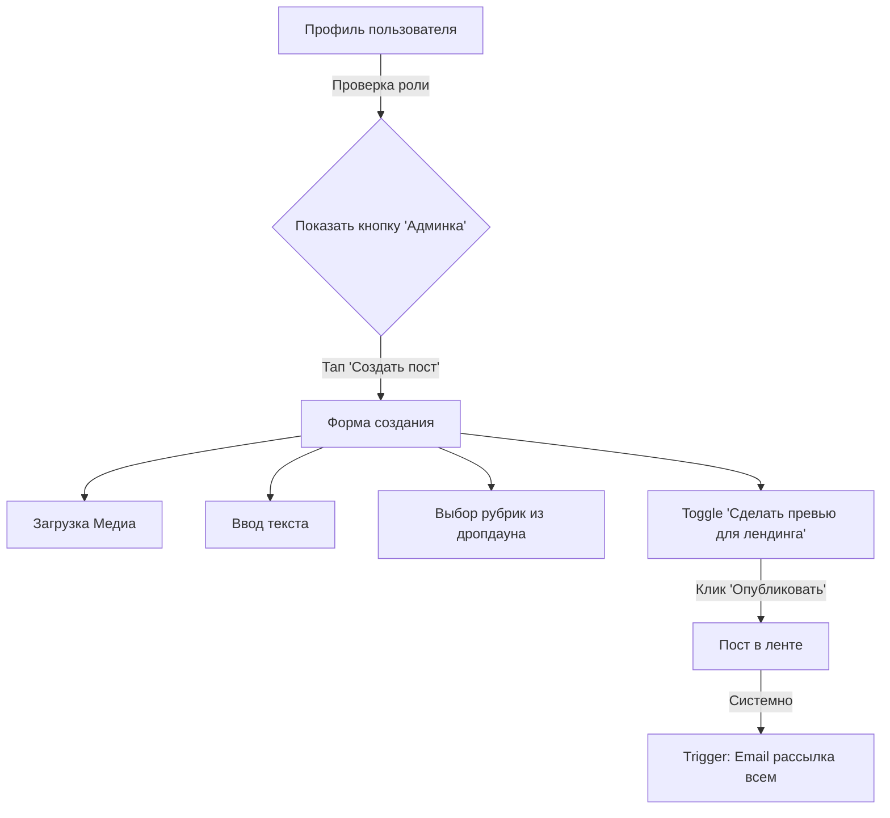

# UX Design Specification PROCONTENT

**Author:** Alex
**Date:** 2026-03-06

---

<!-- UX design content will be appended sequentially through collaborative workflow steps -->

## Executive Summary

### Project Vision

PROCONTENT — это закрытая платная веб-платформа (SPA) для словенских создательниц контента, объединяющая экспертные знания, живое общение и оффлайн-встречи. Продукт решает проблему хаотичности и изоляции, характерную для Telegram-каналов, создавая структурированное, безопасное и культурно близкое пространство. Главная ценность продукта — чувство принадлежности к профессиональному комьюнити и понятная навигация по базе знаний, а также полная автоматизация подписок (Stripe) для автора.

### Target Users

1. **Анна (Первичная аудитория):** 22–30 лет, начинающая креаторка/UGC. Потребляет контент со смартфона. Чувствует себя одиноко в своем увлечении, нуждается в пошаговой поддержке, базовых знаниях и поддерживающем комьюнити.
2. **Мария (Вторичная аудитория):** 25–35 лет, опытная креаторка. Ищет профессиональный нетворкинг, продвинутые инсайты по алгоритмам Instagram и выход на бренды.
3. **Лена (Вторичная аудитория):** 25–40 лет, владелица малого бизнеса. Хочет научиться самостоятельно снимать качественный контент для своего бренда, экономя на SMM.
4. **Автор / Администратор:** Создательница платформы, которой нужен удобный интерфейс для публикации контента разных форматов, управления рубриками и мониторинга оплат без рутины.

### Key Design Challenges

- **Mobile-First лента контента:** Создание плавного и интуитивно понятного скролла ленты (в стиле Instagram/TikTok) в рамках мобильного браузера, с поддержкой различных форматов (текст, видео, фото) без потери производительности.
- **Бесшовный Onboarding:** Быстрое снятие "тревожности чистого листа" у новых участниц путем немедленного вовлечения (Топ-5 постов) и перенаправления в WhatsApp-чат для формирования чувства сопричастности.
- **Навигация по огромному архиву:** Решение "проблемы Telegram" — проектирование удобных, всегда доступных фильтров (sticky "таблетки" рубрик) и поиска, чтобы пользователи легко находили нужный контент среди 2-летнего архива.
- **Публичная зона (Лендинг):** Проектирование высококонверсионной страницы для незарегистрированных пользователей с превью-постами и интеграцией Stripe.
- **Admin Dashboard:** Создание простого интерфейса для автора (публикация, превью, управление Stripe-статусами).

### Design Opportunities

- **Геймификация и визуализация статуса:** Использование бейджей достижений, прогресс-баров и ролей (новичок, опытный) в профиле пользователя для стимулирования retention и гордости за принадлежность к клубу.
- **Гибридное потребление контента:** Разделение опыта на сфокусированное чтение (детальная страница поста с ветками комментариев) и быстрое сканирование (лента превью с фильтрами по рубрикам, например `#insight`).
- **Высококонверсионный Landing Page:** Использование реальных превью-постов и социальных доказательств (отзывов) для создания доверия у незарегистрированных посетителей, приходящих из Instagram, с минимальным трением при оплате через Stripe.

## Core User Experience

### Defining Experience

Основной опыт взаимодействия строится вокруг бесшовного перехода от скроллинга контента к социальной вовлеченности. Для Анны (нашей основной персоны) процесс нахождения решения её проблемы должен напоминать привычный паттерн листания соцсетей, но с нулевым уровнем "информационного шума" и 100% концентрацией пользы. Вторичный фокус — на мгновенном получении поддержки от комьюнити (бесшовный переход в WhatsApp или ветку комментариев).

### Platform Strategy

- **Mobile-First SPA:** Интерфейс проектируется в первую очередь под экраны смартфонов (от 375px), учитывая паттерны управления большим пальцем одной руки (Bottom Navigation, свайпы).
- **Гибридный рендеринг:** Публичные страницы (лендинг, превью) оптимизированы для быстрой загрузки (SSR/SSG) и SEO для привлечения трафика из Instagram, в то время как закрытая зона работает как плавный SPA.
- **Отказ от нативных приложений в MVP:** Веб-приложение должно мимикрировать под нативное (отсутствие прыжков при переходе между вкладками, использование кэширования для создания ощущения мгновенного отклика).

### Effortless Interactions

- **Навигация в 1 клик:** Горизонтальный скролл sticky-"таблеток" с рубриками, позволяющий отфильтровать 2-летний архив без перехода на отдельную страницу.
- **Интеграция с WhatsApp:** Переход из онбординга или профиля прямо в чат комьюнити одним тапом.
- **Оплата и управление подпиской:** Использование Stripe Customer Portal для отмены/продления подписки без необходимости общаться с поддержкой платформы.

### Critical Success Moments

- **Первые 3 минуты (Onboarding):** Новая участница должна за первые 3 минуты понять структуру клуба, прочитать первый "пост для новичка" и вступить в WhatsApp-чат, почувствовав себя частью "своей стаи".
- **Момент "Aha!":** Нахождение конкретного практического совета (через поиск или фильтр) и его успешное применение "сегодня вечером".
- **Социальное признание:** Получение ответа от Автора или опытных креаторов на свой комментарий.
- **Конверсия:** Момент, когда незарегистрированный пользователь понимает ценность из превью-поста на лендинге и совершает импульсивную покупку.

### Experience Principles

- **Паттерны соцсетей важнее инноваций интерфейса:** Используем знакомые паттерны Instagram/TikTok (ленты, истории-подобные форматы для превью), чтобы не заставлять Анну переучиваться.
- **Геймификация без давления:** Поощрять вовлеченность (бейджи, прогресс), но не наказывать за неактивность (платформа должна быть полезным инструментом, а не "еще одной обязанностью").
- **Никаких "глухих стен" (Dead Ends):** Каждый экран должен предлагать следующее действие (после прочтения поста — похожие по теме или призыв к обсуждению).
- **Автоматизация рутины (для Автора):** Интерфейс администратора должен быть столь же простым и понятным, как публикация поста в личный блог.

## Desired Emotional Response

### Primary Emotional Goals

Главная эмоция, которую должен вызывать PROCONTENT — это **уверенность через принадлежность** (Empowered Belonging). Пользователь должен чувствовать: "Я не одна, я в правильном месте, и здесь мне понятно, что делать дальше". Платформа должна ощущаться как уютное, но профессиональное пространство ("уютная кофейня для своих", а не "холодный лекционный зал").

### Emotional Journey Mapping

- **Знакомство (Лендинг):** Доверие и облегчение ("Наконец-то кто-то говорит на моем языке и понимает мои проблемы").
- **Сразу после оплаты (Onboarding):** Радостное предвкушение и ясность ("Меня тут ждали, я знаю, с чего начать").
- **Потребление контента (Core Action):** Сфокусированность и инсайт ("Никакой воды, только польза, хочу попробовать это сегодня").
- **Взаимодействие (Комментарии/WhatsApp):** Сопричастность и безопасность ("Я могу задать глупый вопрос, и меня не осудят").
- **Возвращение на платформу:** Спокойствие ("Если я что-то забыла, я легко это найду в архиве").

### Micro-Emotions

- **Уверенность (вместо Растерянности):** Достигается за счет четких инструкций (Топ-5 постов) и отсутствия бесконечного неструктурированного скролла.
- **Признание (вместо Невидимости):** Достигается за счет геймификации в профиле (статусы, бейджи) и видимости автора в комментариях.
- **Спокойствие (вместо FOMO):** Пользователь не должен бояться пропустить контент (как в Telegram). Фильтры и поиск дают эмоцию контроля над базой знаний.

### Design Implications

- **Уверенность через принадлежность:** Использование теплой, дружелюбной типографики и микрокопирайтинга (Tone of Voice: "Привет, мы тебе рады", а не "Пользователь успешно авторизован").
- **Спокойствие:** Использование обильного "воздуха" (white space) в интерфейсе, чтобы отделить единицы контента друг от друга и снизить когнитивную нагрузку.
- **Признание:** Аватарки пользователей в комментариях и визуальное отображение их статуса (новички/опытные) для укрепления социальных связей.
- **Сфокусированность:** Отсутствие всплывающих окон, баннеров и агрессивных up-sell предложений внутри платной зоны.

### Emotional Design Principles

- **Безопасность важнее статусности:** Интерфейс должен поощрять вопросы и участие, не создавая иерархии, где новички боятся писать (эмоционально безопасная среда).
- **Празднование малых побед:** Визуальное подкрепление простых действий (например, приятная микроанимация при сохранении поста или написании первого комментария).
- **Прозрачность как основа доверия:** Предельно ясный интерфейс управления подпиской Stripe (без "спрятанных" кнопок отмены).

## UX Pattern Analysis & Inspiration

### Inspiring Products Analysis

- **Instagram / TikTok:** Главный источник вдохновения для ленты контента. Пользователи привыкли к бесконечному вертикальному скроллу, акценту на визуальную составляющую (крупные карточки, автовоспроизведение видео) и быстрым социальным реакциям (лайк по двойному тапу).
- **YouTube (Mobile):** Отличный референс для реализации навигации по архиву. Верхняя панель с горизонтально скроллящимися "таблетками" (фильтрами) позволяет быстро переключаться между темами без ухода с главного экрана.
- **Substack / Medium:** Вдохновение для детальных страниц текстовых постов. Чистая, акцентная типографика, много "воздуха", фокусировка исключительно на тексте без отвлекающих элементов по бокам.

### Transferable UX Patterns

**Navigation Patterns:**
- **Bottom Navigation Bar (Mobile):** Классический паттерн из 3-4 иконок (Лента, Поиск/Архив, Профиль) для мгновенного доступа к ключевым разделам одной рукой.
- **Sticky Pill Filters:** Закрепленные при скролле горизонтальные теги рубрик (например, `#insight`, `Разборы`) прямо над лентой.

**Interaction Patterns:**
- **Skeleton Loading:** Использование скелетной загрузки вместо крутящихся спиннеров для создания ощущения мгновенной работы приложения (мимикрия под натив).
- **Бесшовный переход к обсуждению:** Показ 1-2 самых популярных комментариев прямо в карточке поста (как в Instagram), чтобы стимулировать желание зайти в ветку и ответить.

**Visual Patterns:**
- **Аватарки как индикатор статуса:** Использование визуальных рамок или микро-бейджей рядом с аватаром (вдохновлено обводкой Stories в Instagram) для отображения статуса участницы (Новичок, Опытная).

### Anti-Patterns to Avoid

- **"Эффект Telegram" (Хронологическая свалка):** Отсутствие визуального разделения между разными типами контента. Мы должны четко выделять форматы (большая статья vs короткая заметка) на уровне UI карточки.
- **Бургер-меню (Hamburger Menu) на мобильных:** Скрытие важной навигации в выезжающем сбоку меню. Вся основная навигация должна быть в нижнем таб-баре.
- **Всплывающие окна (Pop-ups):** Использование модальных окон, прерывающих чтение (кроме критичных системных уведомлений или процесса оплаты).
- **Многоуровневая вложенность:** Заставлять пользователя делать более 2 тапов, чтобы добраться до нужного контента (например, прятать рубрики глубоко в профиле).

### Design Inspiration Strategy

**What to Adopt:**
- Паттерн ленты Instagram для главного экрана (снижает когнитивную нагрузку на обучение интерфейсу).
- Фильтры-таблетки из YouTube для категоризации (решает главную боль потери контента в архиве).

**What to Adapt:**
- Паттерн комментариев: адаптируем его под более вдумчивые обсуждения (древовидная структура), а не просто быстрые реакции.
- Профиль пользователя: превращаем его из "витрины для других" в "доску личных достижений и настроек".

**What to Avoid:**
- Полностью избегаем сложных дашбордов и табличного отображения информации.

## Design System Foundation

### Design System Choice

**Tailwind CSS + Headless UI (например, shadcn/ui)**
Для PROCONTENT мы выбираем компонентный подход на базе утилитарного CSS-фреймворка (Tailwind CSS) в связке с headless-компонентами (shadcn/ui или аналог под выбранный JS-фреймворк). Мы осознанно отказываемся от тяжеловесных готовых UI-библиотек (вроде Material Design или Ant Design).

### Rationale for Selection

- **Уникальный "нативный" вид (Uniqueness):** Нам нужно воссоздать паттерны Instagram/TikTok (чистый интерфейс, акцент на контент). Тяжелые UI-фреймворки имеют свой ярко выраженный стиль, с которым придется бороться. Tailwind позволяет легко собрать нужный "невидимый" дизайн.
- **Скорость для соло-разработчика:** Headless-компонентами (shadcn/ui) дают готовые, доступные (accessible) сложные элементы (модальные окна, дропдауны, скелетоны), которые копируются в проект и стилизуются под наши нужды за минуты.
- **Производительность (Performance):** Zero-runtime CSS (Tailwind) и минимальный размер бандла критически важны для достижения наших нефункциональных требований (NFR): LCP ≤ 2.5 сек и TTI ≤ 4 сек на мобильных устройствах с 3G-сетью.

### Implementation Approach

- **Mobile-First Breakpoints:** Разработка базовых стилей ведется строго под мобильные экраны (375px/390px). Десктопная версия (от 768px и выше) реализуется через прогрессивное улучшение (например, превращение нижнего таб-бара в боковое меню), а не перестройку карточек контента.
- **Токены дизайна (Design Tokens):** Использование CSS-переменных для управления цветами (светлая/тёмная тема), радиусами скругления и типографикой для обеспечения абсолютного визуального единообразия.

### Customization Strategy

- **Типографика:** Использование чистых, современных sans-serif шрифтов с высокой читаемостью на смартфонах, которые поддерживают дружелюбную и "свою" эмоциональную тональность.
- **Микро-взаимодействия (Micro-interactions):** Активное использование состояний `:active` и CSS-транзиций для кнопок и карточек, чтобы имитировать мгновенный тактильный отклик нативного приложения (сжатие кнопки при тапе).
- **Специфичные компоненты:** Кастомная реализация критически важных элементов (Bottom Navigation Bar и скроллящихся горизонтальных "таблеток" рубрик), так как от их эргономики зависит успех основной персоны (Анны).

## 2. Core User Experience

### 2.1 Defining Experience

**"Найти инсайт, применить, обсудить со своими."**
Ключевой опыт PROCONTENT — это комбинация привычного потребления контента (лента Instagram) со структурированностью базы знаний и ощущением закрытого клуба. В отличие от Telegram, где старый полезный контент "умирает" под лавиной новых сообщений, здесь пользователь может в один клик отфильтровать 2-летний архив и мгновенно перейти к обсуждению найденного материала.

### 2.2 User Mental Model

**Как пользователи мыслят сейчас:**
- *Паттерн соцсетей:* Привыкли к быстрому, вертикальному скроллу и визуальному контенту (Instagram, TikTok).
- *Паттерн обучения:* Привыкли, что курсы и полезные материалы находятся на скучных платформах (Kajabi, GetCourse), куда нужно специально "заставлять" себя заходить.
- *Паттерн общения:* Telegram-каналы, где всё свалено в одну кучу: и важные анонсы, и полезные посты, и флуд в комментариях. Найти что-то старое — боль.

**Наше решение:** Мы берем паттерн соцсетей (лента) и накладываем его на премиальный образовательный контент, убирая хаос с помощью "таблеток" фильтрации.

### 2.3 Success Criteria

- **Скорость поиска ценности:** Пользователь может найти пост на конкретную тему (например, выбрав рубрику `#insight`) менее чем за 3 секунды после входа.
- **Бесшовность вовлечения:** Переход от чтения поста к чтению/написанию комментария занимает ровно 1 тап (без загрузки новых тяжелых страниц).
- **Социальное подтверждение:** Моментальное визуальное отображение оставленного комментария с аватаром и бейджем статуса участницы.

### 2.4 Novel UX Patterns

Мы **не используем** принципиально новые (novel) UX-паттерны, требующие обучения. Наша инновация заключается в комбинации:
Мы берем **установленные паттерны** (Bottom Navigation, бесконечный скролл, Sticky Pill Filters из YouTube) и применяем их к платному образовательному комьюнити. Это снижает когнитивную нагрузку Анны до нуля — она интуитивно понимает, как пользоваться платформой с первой секунды.

### 2.5 Experience Mechanics

**Механика ключевого взаимодействия (Поиск и Обсуждение):**

1. **Initiation (Начало):** Пользователь открывает платформу и видит хронологическую ленту постов. Сверху закреплена панель с рубриками ("Все", "Тема месяца", "Разборы").
2. **Interaction (Взаимодействие):** Пользователь тапает на таблетку "Разборы".
3. **Feedback (Отклик системы):** Мгновенно (без перезагрузки всей страницы, используя Skeleton Loading) лента фильтруется, оставляя только нужные карточки постов.
4. **Deep Dive (Погружение):** Пользователь тапает на иконку "Комментарии" 💬 в футере заинтересовавшей карточки. Снизу плавно выезжает панель (Bottom Sheet) или открывается экран с обсуждением.
5. **Completion (Завершение):** Пользователь отправляет свой комментарий. Он появляется мгновенно (Optimistic UI update), сопровождаемый легкой микро-анимацией, давая чувство завершенности и сопричастности к дискуссии.

## Visual Design Foundation

### Color System

**Концепция: "Теплый минимализм" (Warm Minimalism)**
Палитра должна передавать ощущение "уютной кофейни", быть эстетичной, но не перетягивать внимание с самого контента (фото и видео авторов).

- **Background (Фоны):** Отказ от чистого белого (`#FFFFFF`) и глухого черного. Используем теплые оттенки белого (например, Alabaster или Cream: `#FAFAFA`, `#FDFBF7`) для снижения нагрузки на глаза и создания ощущения "премиальности".
- **Primary Accent (Главный акцент):** Приглушенный, "природный" цвет, который ассоциируется с ростом и спокойствием. Например, приглушенный терракотовый (Muted Terracotta), теплый персиковый или мягкий шалфейный (Sage Green). Этот цвет используется только для целевых действий (кнопка оплаты, отправка комментария).
- **Typography Colors:** Глубокий темно-серый или серо-коричневый (Dark Charcoal) вместо чистого черного `#000000` для основного текста — это делает чтение более комфортным.
- **Semantic Colors:** Мягкие версии системных цветов (Success, Error, Warning), чтобы даже сообщения об ошибках не выглядели агрессивно.

### Typography System

- **Primary Typeface (UI & Body):** Системные шрифты (San Francisco для iOS, Roboto для Android) или чистые геометрические гротески (например, *Inter*, *DM Sans*, *Plus Jakarta Sans*). Они обеспечивают максимальную читаемость на мелких экранах и идеальны для UI-элементов.
- **Secondary Typeface (Headings & Accents):** Для заголовков на лендинге и карточек онбординга можно использовать более выразительный шрифт (современный гротеск с характером или даже элегантный serif), чтобы добавить бренду индивидуальности (например, *Playfair Display* или *Lout).*
- **Иерархия:** Четкий контраст размеров. Крупные заголовки (H1: 28-32px на мобайле), читаемый базовый текст (Body: 16px) с увеличенным межстрочным интервалом (1.5) для легкости восприятия.

### Spacing & Layout Foundation

- **Базовая сетка (8pt Grid):** Использование отступов, кратных 8 (8, 16, 24, 32px), что обеспечит математическую гармонию и легкость верстки в Tailwind.
- **Воздух (White Space):** Обильное использование пустого пространства. Контент не должен "задыхаться". Карточки постов разделяются щедрыми отступами (от 24px), чтобы визуально разделить информационные блоки.
- **Контейнеры:** На мобильных устройствах контент растягивается на всю ширину (с безопасными полями в 16px по краям), карточки могут иметь минимальное скругление (rounded-xl, ~12-16px) для мягкости.

### Accessibility Considerations

- **Контрастность:** Все текстовые элементы должны проходить проверку контрастности WCAG 2.1 Level AA (не менее 4.5:1 для обычного текста). Серый текст не должен быть слишком светлым.
- **Размер областей нажатия (Touch Targets):** Все интерактивные элементы (кнопки, иконки лайков/комментариев, "таблетки" рубрик) должны иметь минимальный размер 44x44 CSS пикселей для безошибочного попадания пальцем.
- **Focus States:** Явно видимые состояния фокуса для десктопной навигации клавиатурой (обязательно для NFR).

## Design Direction Decision

### Design Directions Explored

В ходе планирования мы концептуально исследовали несколько направлений для отображения контента:
1. **"Классический блог"** — как Medium или Substack (текст-ориентированный).
2. **"Платформа онлайн-курсов"** — как Kajabi (жесткая структура, модули, уроки).
3. **"Социальная лента"** — как Instagram/TikTok (динамичный, визуальный, бесконечный скролл).

### Chosen Direction

**Направление "Социальная лента" (Social Feed Pattern) с фильтрацией из YouTube.**
Мы выбираем комбинацию привычной ленты постов (карточки, медиа на всю ширину, социальные кнопки внизу) с закрепленной панелью горизонтальных фильтров рубрик (Sticky Pill Filters) для управления архивом. 

### Design Rationale

- **Снижение когнитивной нагрузки:** Наша основная персона (Анна) потребляет контент в Instagram/TikTok. Используя тот же паттерн ленты, мы убираем необходимость обучать ее новому интерфейсу. Платформа сразу кажется "своей".
- **Визуальная вовлеченность:** В нише создания контента (SMM, UGC) визуальная составляющая (видео, фото до/после) важнее длинных текстов. Паттерн карточек с крупными превью решает эту задачу лучше всего.
- **Решение проблемы Telegram:** В отличие от мессенджера, где контент теряется, наше направление вводит жесткую категоризацию сверху ленты (фильтры), позволяя превратить 2-летний архив в полезную базу знаний без создания сложных дашбордов.

### Implementation Approach

- **Карточки контента:** Унифицированный компонент `PostCard`, который адаптируется под тип контента (видео-плеер, галерея изображений, текстовое превью).
- **Sticky Header:** Фильтры рубрик жестко закрепляются под основным Header-ом при скролле вниз, чтобы пользователь мог сменить контекст в любую секунду.
- **Micro-interactions:** Использование легких анимаций (transition) на кнопках лайков и при добавлении комментариев для создания ощущения мгновенного отклика (Optimistic UI), что характерно для нативных приложений.

## User Journey Flows

### 1. Onboarding & First Value (Journey 1: Анна)
*Как новая участница попадает в клуб и получает первую ценность.*

**Оптимизация:** 
- Убираем лишние шаги заполнения профиля при регистрации (имя/аватар можно добавить позже).
- WhatsApp-ссылка дается *до* перехода в общую ленту, так как комьюнити — ядро продукта.

### 2. Targeted Search & Rescue (Journey 2: Анна — Edge Case)
*Как участница находит нужный ответ в архиве, когда хочет отменить подписку.*

**Оптимизация:**
- Фильтры ("таблетки") всегда на экране. Если пользователь не знает, как сформулировать запрос текстом, он просто тапает на готовую рубрику.
- Использование Skeleton-загрузки при фильтрации (без перезагрузки страницы).

### 3. Content Creation & Admin (Journey 3: Автор)
*Как основательница публикует контент.*

**Оптимизация:**
- Админка не вынесена на отдельный поддомен. Это просто скрытая вкладка в профиле, чтобы Автор мог управлять клубом прямо с телефона "на ходу".

### Journey Patterns
- **Floating Actions:** Ключевые действия (поиск, фильтры) всегда прилипают к краям экрана и не уезжают при скролле.
- **Bottom Sheets (Шторки):** Вместо открытия новых страниц для комментариев или настроек, используем всплывающие снизу панели. Это сохраняет контекст (пользователь видит, что лента осталась на фоне).

### Flow Optimization Principles
- **Progressive Disclosure:** Не вываливаем на Анну весь 2-летний архив сразу. Сначала Топ-5 (онбординг), затем лента, затем фильтры по мере возникновения потребности.
- **Optimistic UI:** Комментарии и лайки отображаются как "успешные" мгновенно, до получения ответа от сервера, чтобы интерфейс казался "летающим".

## Component Strategy

### Design System Components

**Используем из коробки (shadcn/ui):**
- **Buttons (Кнопки):** Primary, Secondary, Ghost (для действий вроде лайка), Outline.
- **Inputs & Forms:** Поля ввода для создания постов, написания комментариев и логина.
- **Dialog / Drawer:** Для модальных окон (например, подтверждение отмены подписки). Для мобильной версии Drawer (шторка снизу) предпочтительнее модального окна по центру.
- **Skeleton:** Для отображения состояния загрузки контента (ленты, результатов поиска), чтобы мимикрировать под нативные приложения.
- **Dropdown Menu:** Для управления настройками профиля и выбора рубрик в админ-панели.
- **Avatar:** Стандартный компонент аватара с fallback-инициалами.
- **Toast / Sonner:** Для всплывающих уведомлений ("Ссылка скопирована", "Пост опубликован").
- **ErrorBoundary:** Обертка для изоляции ошибок рендеринга отдельных компонентов (чтобы падение одного блока не ломало всю SPA).
- **Infinite Scroll Wrapper:** Базовый компонент для управления подгрузкой данных и памятью при долгом скролле ленты.

### Custom Components

Эти компоненты являются ядром нашего продукта и не могут быть взяты "из коробки" без существенной доработки.

#### 1. Content Card (PostCard)
**Purpose:** Универсальная единица контента в ленте.
**Anatomy:**
- *Header:* Тег рубрики, Дата, Иконка формата (текст/видео), Кнопка "Опции" (...).
- *Media Block:* Зона для видеоплеера, галереи или акцентного текстового превью (использует `LazyMediaWrapper`). Максимальная высота ограничена (например, 70vh), чтобы пост не занимал больше одного экрана.
- *Content:* Заголовок, превью текста (до 3 строк) с кнопкой "Читать далее".
- *Footer (Social):* Кнопка лайка, Кнопка комментария со счетчиком.

#### 2. LazyMediaWrapper (Утилита)
**Purpose:** Отложенная загрузка тяжелых медиафайлов (фото/видео) с использованием `IntersectionObserver`.
**Anatomy:** Контейнер-плейсхолдер, который заменяется на реальный медиа-элемент только при приближении к viewport (для достижения NFR LCP ≤ 2.5s).

#### 3. Sticky Pill Filters (CategoryScroll)
**Purpose:** Быстрая навигация и фильтрация архива постов.
**Anatomy:** Горизонтально скроллящийся контейнер (без скроллбара) с кнопками-таблетками.
**States:** Default (светло-серый фон), Active (Primary акцентный фон, белый текст).

#### 4. Comment Thread (DiscussionNode)
**Purpose:** Отображение обсуждений с контекстом статуса участника.
**Anatomy:** Аватар, Бейдж статуса (Новичок/Автор), Имя, Текст, Кнопка "Ответить".
**Architecture Note:** Ограничение 1 уровня вложенности реализуется как плоский список с визуальным отступом (flat list with padding), избегая сложной рекурсии в стейт-менеджменте.

#### 5. Bottom Navigation Bar (MobileNav)
**Purpose:** Главная навигация для мобильного вида.
**Anatomy:** 3-4 иконки (Лента, Поиск, Профиль).
**States:** Inactive (серый), Active (Primary цвет + возможно, более толстая иконка).

### Component Implementation Strategy

1. **Mobile-First Data Fetching:** Компоненты, такие как `PostCard`, должны быть готовы рендериться с частичными данными, показывая `Skeleton` для медиафайлов, пока они грузятся.
2. **Абстракция логики:** Визуальное представление (UI) должно быть строго отделено от бизнес-логики (API вызовы). Компоненты вроде `PostCard` должны быть "глупыми" (dumb components), получая данные через props.
3. **Touch-Ready:** Все интерактивные элементы в кастомных компонентах должны строго соблюдать правило 44x44px минимальной области нажатия.

### Implementation Roadmap

**Phase 1 - Core (Для запуска MVP)**
- `MobileNav` (Навигация)
- `PostCard` (Отображение контента в ленте)
- `CategoryScroll` (Фильтрация ленты)

**Phase 2 - Engagement (Для удержания)**
- `DiscussionNode` (Дерево комментариев)
- `Bottom Sheet` (Шторка для написания комментария / поиска)

**Phase 3 - Admin & Growth**
- Форма создания поста (Admin)
- `UserBadge` / Статусы в профиле (Геймификация)

## UX Consistency Patterns

### Button Hierarchy

Для обеспечения предсказуемости действий Анны, мы устанавливаем строгую иерархию кнопок:

- **Primary Button (Главное действие):** Залитая акцентным цветом (Warm Terracotta/Sage). Только одна на экран. *Примеры: "Оплатить подписку", "Опубликовать комментарий", "Вступить в WhatsApp".*
- **Secondary Button (Вторичное действие):** Outline (с обводкой) или светло-серый фон. *Примеры: "Редактировать профиль", "Отмена".*
- **Ghost/Icon Button:** Без фона, только иконка. *Примеры: Сердечко (лайк), Иконка комментария, Навигация в Bottom Bar.*
- **Touch Target:** Минимальный размер любой кликабельной области — 44x44px. Расстояние между двумя кнопками — не менее 8px.

### Feedback Patterns

Пользователь всегда должен понимать, что происходит, без прерывания своего флоу:

- **Optimistic Updates:** Лайки и отправка комментариев отображаются мгновенно (сердечко закрашивается сразу). Если запрос к API падает, тихо откатываем стейт и показываем Toast.
- **Toast Notifications (Sonner):** Всплывающие снизу уведомления, исчезающие через 3 секунды. Используются для некритичных событий ("Ссылка скопирована", "Настройки сохранены").
- **Skeleton Loading:** Вместо крутящихся лоадеров используем мерцающие серые блоки (skeletons), повторяющие форму ожидаемого контента. Это снижает психологическое ожидание загрузки.

### Form Patterns

Формы сведены к абсолютному минимуму:

- **Авторизация:** Magic Link (ссылка на email) вместо паролей, чтобы избавить Анну от необходимости запоминать еще один пароль.
- **Инлайн-валидация:** Проверка email'а на лету, кнопка submit становится активной только когда все поля заполнены корректно.

### Navigation Patterns

- **Mobile Bottom Bar:** Единственный способ перемещения между глобальными разделами (Лента, Поиск, Профиль). Отказ от "Гамбургер-меню".
- **Infinite Scroll:** Лента подгружается автоматически при скролле вниз (через IntersectionObserver). Не используем пагинацию (кнопки "Страница 1, 2").
- **BottomSheet Navigation:** Глубокие переходы (например, открыть настройки профиля или написать длинный комментарий) открываются в шторке поверх текущего экрана, чтобы легко вернуться назад свайпом вниз.

### Additional Patterns

- **Empty States (Пустые состояния):** Если поиск по архиву ничего не дал, показываем дружелюбную графику и предлагаем сбросить фильтры или написать вопрос в WhatsApp комьюнити. Никогда не оставляем пользователя на пустом экране без вариантов действий.

## Responsive Design & Accessibility

### Responsive Strategy

**Mobile-First, Progressive Enhancement**
Поскольку 90%+ трафика (Анна) приходит из Instagram и потребляет контент на ходу, мы проектируем платформу строго под мобильные экраны (Mobile-First). Десктопная версия не является приоритетом для сложной переработки интерфейса — она должна просто не ломаться и быть удобной для автора (публикация контента) и изредка для пользователей, которые смотрят длинные видео с ноутбука.

- **Mobile (Core):** Интерфейс с нижним таб-баром (Bottom Navigation), карточки контента занимают всю ширину (100vw). Управление рассчитано на один большой палец.
- **Tablet / Small Desktop:** Карточки контента ограничиваются по максимальной ширине (например, `max-w-xl`), чтобы строки текста не становились слишком длинными для чтения (оптимально 60-80 символов).
- **Desktop:** Нижний таб-бар превращается в боковую навигационную панель (Sidebar), освобождая вертикальное пространство.

### Breakpoint Strategy

В соответствии с Tailwind CSS (стандартные брейкпоинты), но с акцентом на мобильные устройства:
- **Default (Mobile):** < 640px (от 375px) — Базовый дизайн, фокус на свайпы и тапы.
- **sm:** >= 640px — Для крупных планшетов. Центрирование контента, появление небольших отступов (margins) по краям ленты.
- **md:** >= 768px (Tablet Landscape) — Переход Bottom Navigation в Sidebar.
- **lg:** >= 1024px (Desktop) — Админ-панель для автора перестраивается в двухколоночный вид (слева форма, справа предпросмотр превью-поста).

### Accessibility Strategy

В соответствии с нашими NFR, мы целимся в уровень **WCAG 2.1 AA**, так как это золотой стандарт для современного веба.

- **Зрение (Visual):** Строгое соблюдение контраста текста (4.5:1). Никаких светло-серых шрифтов на белом фоне. Не полагаемся *только* на цвет для передачи информации (ошибки валидации должны иметь иконку + текст, а не просто красную рамку).
- **Моторика (Motor):** Touch Targets не менее 44x44px (требование Apple HIG / Android). Расстояние между интерактивными элементами (например, кнопками лайка и комментария) должно предотвращать случайные "промахи".
- **Когнитивная нагрузка:** "Теплый минимализм" и отсутствие мигающих баннеров снижает стресс. Skeleton загрузка снижает тревожность ожидания.

### Testing Strategy

- **Устройства:** Тестирование на реальных девайсах iOS (Safari) и Android (Chrome), а не только в Chrome DevTools (особенно важно для проверки работы Bottom Sheet на устройствах с "челкой" / Safe Area).
- **Сеть:** Тестирование скорости загрузки (LCP) с троттлингом до Fast 3G, чтобы гарантировать выполнение NFR1/NFR2.
- **Accessibility:** Использование Lighthouse / axe DevTools на этапе CI/CD для автоматической проверки контрастности и ARIA-атрибутов.

### Implementation Guidelines

- Разработчик (Amelia) должен использовать `rem` для всех шрифтов, чтобы они масштабировались в соответствии с системными настройками пользователя.
- Все SVG-иконки и изображения (NFR16) должны иметь `aria-label` или `alt` атрибуты (пустые `alt=""` для декоративных).
- Для десктопа: реализовать `:focus-visible` стили (например, outline кольцо акцентного цвета) для поддержки навигации с клавиатуры (NFR17).
